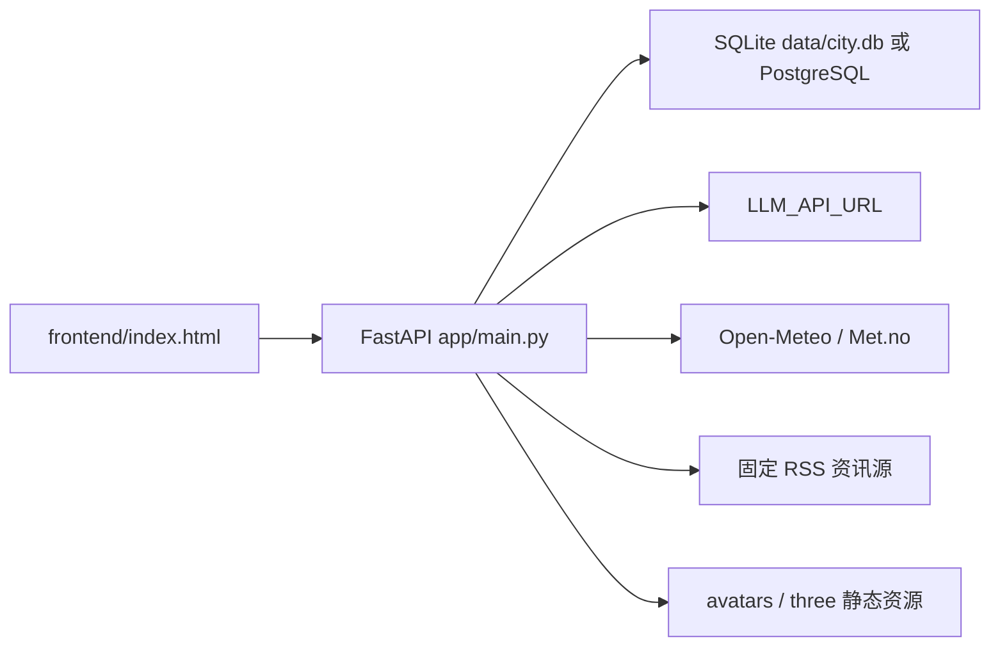
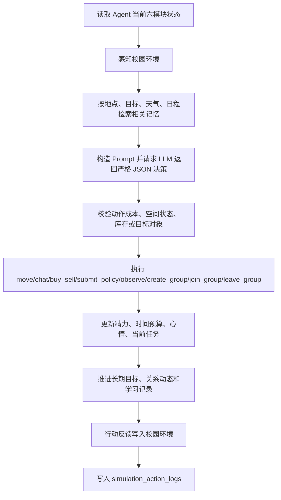

# 架构说明

## 系统定位

本项目是一个基于真实地理的校园多智能体世界。它不是聊天机器人外壳，而是一个可持续演化的小型世界模型：

1. 校园环境提供时间、天气、学期阶段、拥挤度、资源压力和活动事件。
2. Agent 拥有身份、目标、精力、时间预算、日程、关系、记忆和库存。
3. 每次模拟由后端驱动 Agent 感知、检索记忆、调用 LLM 决策、执行动作，并把结果写回环境与个人记忆。
4. 前端从 API 读取世界快照，展示地图、状态、日报和人物详情。

## 运行时组件



## 后端模块

`app/main.py` 是运行时装配入口，职责限定为：

- 创建 FastAPI 应用、注册领域路由和中间件。
- 注册显式的 `app.state` 服务回调，供领域 router 调用。
- 挂接 ASGI lifespan；后台世界 runner 只能在该生命周期内运行。

领域 API 路由包括：

- `app/api/world_router.py`：世界状态、运行控制、快照、分支、环境配置和管理事件。
- `app/api/agent_router.py`：Agent 查询、记忆、决策和工具行动。
- `app/api/campus_router.py`：校园环境、空间、校园事件和政策。
- `app/api/social_router.py`：社交、目标、群体和组织查询。
- `app/api/lifecycle_router.py`：观测会话与生命历程读取。
- `app/api/news_router.py`、`external_router.py`：校园新闻与外部资讯。
- `app/api/research_router.py`、`system_router.py`：研究校准和系统能力。

核心领域模块包含：
- 校园环境派生逻辑，包括真实时间、真实天气和模拟天气。
- 空间系统，包括容量、开放时间、事件影响和可达性校验。
- Agent 六模块状态构造。
- 生命周期主流程：`perceive_environment()`、`decide_agent_action()`、`execute_decision()`、`apply_environment_feedback()`、`record_simulation_log()`。
- 社交、协作、长期目标、日报和外部资讯逻辑。

`app/db.py` 提供数据库连接：

- 未设置 `DATABASE_URL` 时使用 SQLite。
- 设置 `DATABASE_URL` 时使用 PostgreSQL。
- `PostgresConnection` 兼容项目里常见的 SQLite 风格 SQL，如 `?` 参数、`INSERT OR IGNORE`、`INSERT OR REPLACE INTO simulation_state`、`PRAGMA table_info(...)`。

`app/models.py` 保存基础表结构。`app/schema.py` 保存校园新版扩展表结构与默认环境。

### 运行时依赖绑定规则

`app/world_runtime/` 模块由 composition root 注入数据库、时钟和领域回调；它们不得反向导入
`app.main` 或 FastAPI。绑定必须在公开入口调用前刷新，且不得覆盖模块自身的公开函数，避免 wrapper
回注入导致递归。跨模块共享的事件解码等小型逻辑应留在所属领域模块内，不能为单一工具函数新增
`main.py ↔ runtime` 循环导入。

tick、调度和失败记录属于关键入口：它们必须使用同一连接抽象，因此 SQLite 的写锁重试只在 SQLite
路径启用；PostgreSQL/Supabase 错误保持原始数据库语义并向上报告。每次迁移后至少验证状态读取、
tick 推进、到期多尺度更新和失败落库。

`tools/city_tools.py` 是历史命名遗留，但仍是基础行动工具层，提供移动、聊天、交易、库存、事件、记忆和关系更新。后续应逐步按 spatial、social、economy 和 memory 边界拆出，避免继续作为全局工具箱扩张。

## World2 架构边界

World2 的核心不是“Agent 调用 LLM 生成故事”，而是可复现的世界状态演化：

```text
WorldState + AgentState
        ↓
Perception / Decision / Rule Check
        ↓
ActionExecution
        ↓
WorldEvent + State Projection
        ↓
Next Tick / Metrics / Research Snapshot
```

LLM 只负责有限信息下的意图、解释和候选决策；空间准入、资源消耗、时间推进、社会影响、经济结算和事件写入必须由确定性规则完成。真实地理导入只有在进入路径规划、容量、准入和服务规则后，才算进入世界事实层，而不只是前端地图数据。

`services/llm_service.py` 负责调用外部 LLM。当前请求体使用 Google Gemini `generateContent` 风格，header 为 `x-goog-api-key`。

## Agent 生命周期

单个 Agent 的完整流程由 world tick 的行动执行器推进：



如果 LLM 调用或 JSON 解析失败，决策会 fallback 到 `observe`。如果动作执行失败，系统会记录失败结果和成本，不会替 Agent 重新选择另一种行为。

## Agent 六模块

`get_agent_module_state()` 会将一个 Agent 汇总为六个模块：

- `Physical`：位置、身份、精力、时间预算、校园币、情绪、库存。
- `Mental`：长期目标、性格、当前任务。
- `Social`：关系对象、关系分数和说明。
- `Memory`：最近记忆、重要性、类型、标签和来源。
- `Schedule`：日程列表、当前接近日程、是否到点、建议地点。
- `Perception`：最近一次感知或外部资讯片段。

这个结构既服务前端人物详情，也服务 LLM 决策 prompt。

## 校园环境模型

校园环境保存在 `campus_state`。核心字段包括：

- 时间天气：`weather`、`temperature`、`rainfall`、`weekday`、`time_slot`、`semester_stage`、`real_date`、`real_time`。
- 学业压力：`exam_pressure`、`assignment_pressure`、`study_atmosphere`。
- 活动与人流：`activity_heat`、`event_name`、`event_intensity`、各空间 crowd 字段。
- 基础设施：`traffic_status`、`network_status`、`safety_level`、`resource_pressure`。
- 商业与氛围：`consumption_index`、`campus_mood`。

环境可以手动设置，也可以由真实时间、真实天气、模拟日推进和 Agent 行动共同改变。

## 空间模型

真实世界以导入的 `spatial_nodes`、`spatial_edges` 和 `spatial_resources` 为唯一地理事实。`spatial_physical_states` 和 `spatial_facility_states` 持久化天气、人流、噪声、照明、道路状态、库存、服务窗口、维修状态和容量；`get_space_snapshot()` 仅投影这些真实 POI 的当前状态。

## 数据演进策略

所有生产 schema 变化统一通过 Alembic migration 演进。`app/db/bootstrap_schema.py` 的 schema guard 只服务于隔离测试和显式 fresh-world bootstrap；Web 服务不会在启动或请求期间建表、补列或修复旧 schema。部署固定执行 `upgrade head`、真实地理导入和各领域幂等种子。

## 阶段 0 环境底座

World Runtime 已开始绑定版本化环境配置：

- `environment_configs` 保存配置正文、父版本、版本号和 SHA-256 校验和。
- `world_runtime.environment_config_id`、`environment_version` 和 `random_seed` 标识当前运行条件。
- `world_event_stream` 使用 `source_type`、`source_id`、`parent_event_id`、`root_event_id` 和 `rule_version` 保存事件谱系。
- `world_snapshots` 保存客观状态、配置版本、随机种子、外部数据版本和事件游标。
- `world-snapshot-v3` 同时保存目标、承诺、记忆、组织和主观社会状态，可在 checksum 校验后事务恢复。
- `world_branches` 保存独立 base/head 快照；分支切换先封存当前状态，再恢复目标 head。
- `world_event_stream.branch_key` 让跨分支审计历史保持不可变且可区分。
- `world_action_rules` 定义行动前置条件、资源成本、持续时间、成功概率和效果。
- `world_action_executions` 保存每次 active/passive 结算、失败原因及资源前后状态。
- `world_delayed_effects` 由后续 tick 按 `due_at` 幂等结算，并沿来源行动继承事件谱系。
- `economic_actors`、`ledger_accounts`、`ledger_transactions` 与
  `ledger_entries` 构成阶段 2.1 的统一校园币账本。所有已入账交易使用最小货币
  单位整数并保持借贷平衡；`residents.money`、`world_resource_accounts` 和
  `world_resource_transfers` 暂时作为兼容投影与旧接口审计记录。
- `organization_runtime_profiles`、`organization_roles`、角色指派、提案、表决、
  承诺、关系和事件构成阶段 2.2 的组织运行事实层。world tick 只执行达到等待期、
  权限、法定人数和预算约束的提案；组织资金变化继续进入统一账本。
- `catalog_items`、`inventory_accounts`、`inventory_movements`、生产配方与批次、
  服务供给与交付构成阶段 2.3 的供给事实层。world tick 处理到期生产、低库存
  补货和每日损耗，消费行动与居民交易通过统一账本结算真实提供者和有限库存。
- `labor_positions`、`employment_contracts`、`labor_shifts`、收入计划、支付记录和
  周期支出义务构成阶段 2.4 的劳动分配事实层。工资以成功行动的地点、类型和时长
  为证据，并受技能和组织可用预算约束；外部家庭支持必须经过授权流入。
- `household_budget_profiles`、逐日预算快照、储蓄转移和选择评估构成阶段 2.5 的
  预算选择事实层。行动同时受可支配资金和实际时间约束；基础储蓄使用统一账本，
  信用、透支与借款在阶段 2.7 前固定关闭。
- `market_mechanisms`、小时价格快照、需求信号和摩擦事件构成阶段 2.6 的市场事实层。
  价格由成本、库存、需求、容量和环境压力确定；需求由需要、偏好、社会影响、
  支付意愿和预算约束确定，缺货、替代与配给保留为结构化结果。
- 储蓄目标、风险档案、经济冲击、共济赔付、信用产品、信用档案、合同、分期、
  支付和信用事件构成阶段 2.7 的家庭风险与信用事实层。放款由真实准备金支持，
  本金、利息和违约同时改变双方账本与借款人的未来预算和机会。
- 公共服务定义、每日运行、居民使用、外部性事件与暴露、政策工具、受益记录和
  群体结果快照构成阶段 2.8 的公共政策事实层。政策基金是独立公共经济主体，
  服务成本、补贴和公共投资都通过统一账本支付。
- 信息主张、转述版本、传播路径、暴露、信念、制度规则、案件、决定、居民权力画像
  和制度信任事件构成阶段 2.9 的社会制度事实层。传播必须绑定接触或关系证据，
  奖励和处罚继续通过统一账本结算。
- 宏观指标定义、窗口快照、分组指标值、底层组成和核验结果构成阶段 2.10 的派生事实层。
  宏观层只读取账户、交易和机制事件，并保存来源游标；关键核验失败时快照不可作为有效
  统计结果。
- `world-snapshot-v19-macro-reconciliation` 同时保存组织治理、生产库存、劳动合同、
  预算市场、信用、公共政策、传播、制度程序、权力信任和宏观核验状态。

快照支持 admin 恢复和顺序分支切换。恢复要求 runtime 已暂停，默认先创建自动备份；当前版本只允许居民拓扑一致的快照恢复，人口增删分支将在阶段 3 人口流动机制中处理。

Agent 涌现、群体模式识别、编辑 Agent 与制度反馈的后续演进统一维护在
[ENVIRONMENT_REALISM_ROADMAP2.md](ENVIRONMENT_REALISM_ROADMAP2.md)。

## 前端结构

`frontend/index.html` 是单文件应用，后端通过 `FileResponse` 返回页面，并挂载：

- `/avatars` -> `frontend/assets/avatars`
- `/three` -> `frontend/vendor/three`

前端主要请求：

- `/api/state`
- `/api/newspaper/agent-posts`
- `/api/external-information`
- `/api/agents/{id}/modules`
- `/api/agents/{id}/social-graph`
- `/api/agents/{id}/timeline`
- `/api/agents/{id}/simulation-logs`

## 新世界边界

新部署只从版本化真实 GeoJSON 建立空间真值；不支持旧城市示例、默认示范校园或历史数据库升级。
维护时优先参考 `scripts/bootstrap_fresh_world.py`、`scripts/import_tsinghua_world.py` 与领域服务。
