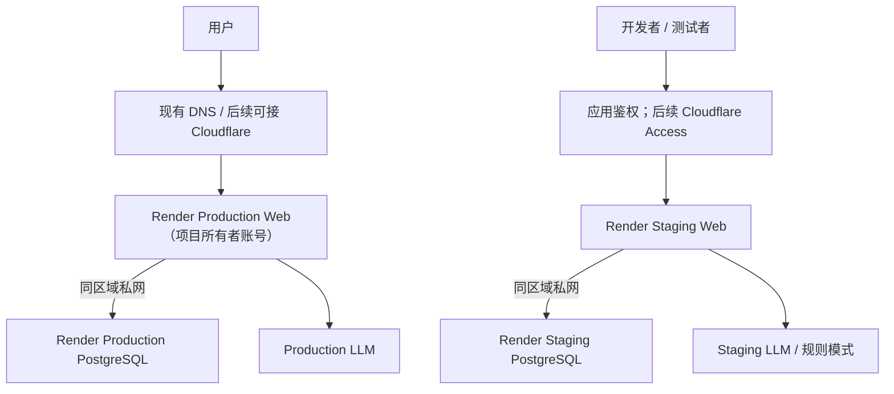
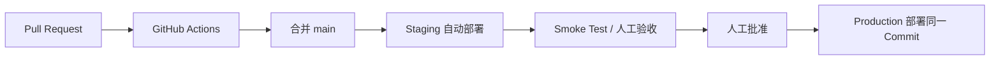

# Production 与 Staging 部署策略

> 状态：实施方案  
> 更新日期：2026-08-02  
> 适用项目：World2 · Agent 平行世界

已确认的时间与账号条件：

- Supabase 当前付费周期截至 **2026-08-30**。
- 当前 Render Production 服务位于同事账号，区域为 Ohio；目标是在本轮迁移后由项目所有者自己的 Render 账号持有。
- Render 已保存现有 Production secrets；迁移时只核对变量名并在新服务中重新录入，不从仓库复制或暴露 secret 值。
- Cloudflare 尚未配置，不作为 2026-08-30 前完成迁移的硬依赖。

## 1. 决策摘要

中短期采用 Render 全栈作为目标生产架构：

```text
DNS / 可选 Cloudflare
    -> Render Web Service
    -> Render PostgreSQL（同区域私网）
```

环境策略：

- Production 与 Staging 都使用独立的 Render PostgreSQL。
- 初期保留 Render Hobby workspace（$0 workspace plan），不为了本次迁移提前升级 Pro。
- Production 与 Staging 位于同一个 Render Project 的两个 Environment；Hobby 当前支持每个 Project 最多两个 Environment，正好满足本方案。
- Production 和 Staging 使用相同的运行时、构建方式、迁移流程和 PostgreSQL 主版本。
- Staging 长期存在；暂不为每个 PR 自动创建完整 Preview Environment。
- 普通 PR 使用 CI + Staging；只有大型 UI、认证、数据库迁移或运行时重构才按需创建 Preview。
- 第一阶段使用 Render 与应用自身的访问控制；Cloudflare 作为切换后的独立安全与缓存改进，不阻塞数据库和账号迁移。

当前 Supabase 已经支付一个月费用，因此使用前三周完成零新增 Render 资源的准备，第四周才创建新的付费 Render 计算资源：

```text
第 1–3 周：Production DB = Supabase；CI/本地 PostgreSQL 完成验证
第 4 周：短期重叠，Supabase Production + Render Staging/Production
最终态：Production DB = Render，Staging DB = Render
```

Render 的 workspace plan 与 Web/PostgreSQL 的计算费用是两件事：Hobby workspace 为 $0，但新建付费 Web 或数据库仍会产生计算费用。第四周才创建资源可以减少重叠费用。Pro 的 $25/月暂不需要；当团队协作、审计、全栈 Preview、自动扩缩容或更强隔离成为刚需时再升级。

不建议立即关闭 Supabase，也不建议等到续费最后一天再迁移。正式切换应安排在当前账期结束前至少 5–7 天；切换验证通过后关闭自动续费或降级，并尽量把 Supabase 保留为只读回退源直到已付账期结束。

## 2. 目标与非目标

### 2.1 目标

- 消除 Render 与 Supabase 之间的跨云数据库 egress。
- 让每个生产版本都先在独立 Staging 环境验证。
- 让数据库迁移在应用切流前执行，并能阻止错误版本上线。
- Production 与 Staging 的数据、凭据、LLM 预算和网络边界完全隔离。
- 费用可以随业务增长，但每次增长都有监控指标和明确触发条件。
- 明确备份、恢复、回滚和故障处理流程。
- 为未来拆分 Web API 与 World Runner 做准备。

### 2.2 当前非目标

- 不为每个 PR 自动创建全栈 Preview。
- 不立即启用数据库 HA 或 Read Replica。
- 不在本轮迁移中同时重写全部业务模块。
- 不将 Staging 直接连接到 Production 数据库。
- 不使用 Production LLM key、管理员 token 或第三方凭据运行 Staging。

## 3. 当前状态与主要风险

### 3.1 当前部署

- FastAPI Web Service 已部署在 Render。
- Production PostgreSQL 当前位于 Supabase。
- 浏览器只访问 Render API，Render 再访问 Supabase。
- `render.yaml` 已存在，但数据库部署脚本目前位于 `buildCommand`。
- 仓库已具备 Alembic migration、幂等种子、账本审计和 PostgreSQL 部署锁。
- 仓库目前没有 GitHub Actions CI。
- 应用目前没有专用 `/health/live` 和 `/health/ready`。
- World Runner 默认自动启动，并每 5 秒检查数据库、默认每 60 秒推进一次 tick。

### 3.2 当前高风险项

1. 数据库跨云导致 Supabase egress 和额外网络延迟。
2. 数据库初始化在 build 阶段执行，新版本尚未通过健康检查就可能修改生产数据库。
3. 缺少 CI，Render 无法使用“CI checks 通过后部署”作为有效门禁。
4. `ADMIN_TOKEN` 未设置时，部分管理员接口会放行。
5. 多个会写数据库、触发模拟或调用 LLM 的接口缺少统一鉴权。
6. World Runner 的锁是进程内锁；零停机部署期间旧、新实例短暂重叠，可能重复推进。
7. Staging 如果公开访问，会产生 LLM、数据库写入和流量费用。
8. `/api/state` 和 observer state 响应偏大，浏览器轮询会放大 Render outbound。

## 4. 目标环境拓扑



建议资源：

| 环境 | Web | PostgreSQL | World Runner | 访问方式 |
| --- | --- | --- | --- | --- |
| Production | Render Starter 或按指标升级 | Basic-1GB 起步 | 初期随 Web，后续独立 Worker | 现有入口；后续 Cloudflare |
| Staging | Render Starter；空闲时可暂停 | Basic-256MB 或 Basic-1GB | 默认关闭自动启动 | 应用鉴权；后续 Cloudflare Access |

区域选择规则：新 Production Web、Production DB、Staging Web 和 Staging DB 必须选择同一区域。现有服务在 Ohio，不代表新账号也必须选 Ohio；应按主要用户所在地决定 Ohio 或 Frankfurt。不要在本次迁移中形成 Web 在 Ohio、数据库在 Frankfurt 的跨区域架构。

说明：Render `preDeployCommand` 仅适用于付费 Web、Private Service 和 Background Worker。为了让 Staging 使用与 Production 一致的安全迁移流程，Staging Web 推荐使用付费 Starter，而不是 Free。

### 4.1 Hobby 与 Pro 的本阶段选择

- 使用 Hobby workspace，不支付 $25/月的 Pro workspace plan。
- 在同一个 Project 中创建 Production、Staging 两个 Environment，并分别创建 Web、PostgreSQL 和 Environment Group。
- 两套环境必须使用唯一的服务名、独立数据库、独立账号和独立 secret；即使平台界面没有提供某项隔离开关，也不能依赖命名来防止串库。
- 如果 Dashboard 提供 `Block cross-environment connections`，两个 Environment 都启用；同时将数据库外部访问限制到迁移所需的最小范围。
- 不启用全栈 Preview。Hobby 的两个长期 Environment 留给 Production 和 Staging。
- 出现以下任一情况再升级 Pro：需要第二位及以上成员管理生产、需要 workspace audit log/合规材料、需要全栈 Preview 或横向自动扩缩容、或 Hobby 的隔离能力无法满足安全要求。

## 5. 一个月过渡策略

Supabase 当前付费周期截至 2026-08-30。以下四周以 2026-08-02 为起点，并为切换失败保留余量。

### 第 1 周：止血、盘点与冻结费用

Production 继续使用 Supabase，不改变用户流量，也不创建新的 Render 付费资源。

工作内容：

- 在 Supabase 开启 Spend Cap 和用量告警。
- 记录当前 Supabase：数据库大小、表行数、连接方式、区域、账期结束日和 egress。
- 在 Supabase Billing 页面再次确认 2026-08-30 的具体时区和时间，并把正式切换安排在续费前 5–7 天。
- 保持 Render Hobby，不创建新的付费 Web 或 PostgreSQL。
- 完成 Render 资源命名、区域、规格、Environment Group、域名和 secret 清单。
- 准备 Production 与 Staging 两份变量模板；模板只包含变量名，不写真实 secret。
- 固定 PostgreSQL 主版本，并确认 Supabase 与目标 Render PostgreSQL 的扩展兼容性。
- 建立切换 checklist、维护窗口通知模板和回退判定标准。

本周验收标准：

- 已知续费截止点、迁移窗口和可接受停写时长。
- 已确定第四周需要创建的全部资源及预计费用。
- Production 与 Staging 的变量、数据库和凭据没有共享项。
- 前三周没有新增 Render 付费计算资源。

### 第 2 周：补齐代码、CI 和安全基线

Production 仍然使用 Supabase。所有验证使用 GitHub Actions 的临时 PostgreSQL 或本地 PostgreSQL。

仓库改造：

- 增加 `/health/live`。
- 增加 `/health/ready`，检查数据库连接、Alembic revision 和关键表。
- 将数据库部署从 `buildCommand` 移到 `preDeployCommand`。
- 增加 GitHub Actions：单元测试、PostgreSQL migration、bootstrap、ledger audit。
- 准备 Render Staging 的 `After CI Checks Pass` 配置步骤，第四周创建资源后启用。
- 增加部署后 smoke test。
- 非本地环境缺少 `ADMIN_TOKEN` 时拒绝启动。
- Staging 默认不配置 LLM key；第四周上线后仍先使用规则模式。
- 对所有写接口建立统一 RBAC，至少区分 observer、operator、admin。
- 对模拟、LLM、同步和导出接口增加限流。

本周验收标准：

- CI 在临时 PostgreSQL 中从空库完成 migration、bootstrap 和 ledger audit。
- migration 或测试失败时不能合并到 `main`。
- `/health/live` 与 `/health/ready` 的自动测试通过。
- 未认证用户不能触发写操作、模拟或 LLM。
- 非本地环境缺少必要 secret 时应用拒绝启动。

### 第 3 周：本地 PostgreSQL 迁移演练

Production 仍然使用 Supabase。不创建 Render 数据库，在本机受控的 PostgreSQL 容器或专用本地 PostgreSQL 中演练：

1. 记录 Supabase schema revision、表清单、行数和关键业务校验结果。
2. 使用 `pg_dump` 导出 Supabase PostgreSQL。
3. 推荐参数：custom format、`--no-owner`、`--no-acl`。
4. 将备份恢复到与目标 Render 相同主版本的空本地 PostgreSQL。
5. 运行 `scripts/deploy_database.py --require-postgres`。
6. 运行 `scripts/migrate_db.py --check`。
7. 运行 `scripts/audit_economy_ledger.py`。
8. 对比关键表行数、序列、最新事件 ID、运行时状态和账本余额。
9. 将本地应用指向恢复后的数据库，执行 smoke test 和一次手动 tick。
10. 记录导出、恢复、验证耗时，形成正式切换窗口估算。

生产备份和恢复后的本地数据库视为生产敏感数据：只能保存在加密磁盘、不得提交 Git 或上传 CI artifact、不得由其他局域网设备访问；演练后按数据保留政策安全清理。

本周验收标准：

- 至少完成一次从 Supabase 到同版本本地 PostgreSQL 的全量恢复。
- 明确停写窗口预计时长。
- 所有 migration、ledger audit 和核心 smoke test 通过。
- 已验证序列继续增长，不会出现主键冲突。
- 已验证应用没有依赖 Supabase 专有 API。

### 第 4 周：创建 Render Staging、复演并切换 Production

不要等到续费前最后一天才开始。第四周第一天创建资源，正式切换安排在续费前至少 5–7 天。

本次实际窗口：

- **2026-08-02 至 2026-08-15**：代码、CI、安全和配置准备。
- **2026-08-16 至 2026-08-22**：本地 PostgreSQL 恢复演练；确认新 Render 账号、区域和服务命名。
- **2026-08-23**：在项目所有者 Render 账号创建 Project、Staging Web 和 Staging DB。
- **2026-08-24**：Staging 验证和稳定性观察。
- **2026-08-25**：创建 Production DB，完成 Render 上的恢复复演。
- **2026-08-26**：正式迁移和切流。
- **2026-08-27 至 2026-08-29**：监控、修复和最终备份；确认没有旧 Supabase 或同事 Render 服务连接。
- **最晚 2026-08-29**：根据计费渠道执行 Supabase 降级，避免跨过 2026-08-30 形成新周期费用。

#### 第 4 周第 1–2 天：创建并验证 Staging

1. 在现有 Hobby workspace 创建一个 Project，并添加 Production、Staging 两个 Environment；如果 Project 已存在，只添加缺少的 Environment。
2. 创建 Staging PostgreSQL 和 Staging Starter Web，区域与计划中的新 Production Web 一致。
3. 使用独立的 Staging Environment Group，设置 `WORLD_RUNTIME_AUTO_START=false`，不配置 Production secret 和 LLM key。
4. 使用 internal database URL 初始化空库并执行所有 migration、ledger audit 和 smoke test。
5. Cloudflare 尚未配置，因此先使用应用鉴权、强管理员 token 和不可猜测的测试凭据保护 Staging；Cloudflare Access 后续补充。
6. 将 Staging 自动部署设置为等待 CI checks 通过。
7. 完成至少 24 小时的功能和稳定性观察。

#### 第 4 周第 3 天：Render 生产迁移复演

1. 在项目所有者 Render 账号创建 Production PostgreSQL，区域和 PostgreSQL 主版本与 Staging 一致。
2. 用最新 Supabase dump 向 Render Production DB 进行一次可丢弃的恢复复演。
3. 运行 revision、行数、序列、ledger audit 和 smoke test。
4. 记录实际上传、恢复和验证耗时；复演库确认无误后清空或重建为最终目标库。

#### 第 4 周第 4 天起：正式切换

切换前：

- 冻结非必要 schema 变更。
- 确认 Staging 已验证同一个待发布 commit，且新 Production Web 与 PostgreSQL 位于同一区域。
- 确认 Render Production DB 是空数据库或明确的恢复目标。
- 确认 Render 付费 PostgreSQL PITR 已启用。
- 确认 Production Web 的旧 `DATABASE_URL` 和回退方式已安全记录。
- 通知维护窗口。
- 暂停 World Runner。
- 阻止所有写接口，只保留只读页面或维护页面。

正式切换步骤：

1. 在 Supabase 上停止应用写入。
2. 记录最终 revision、表行数、最大主键、最新事件 ID 和账本审计结果。
3. 创建最终 `pg_dump`。
4. 恢复到 Render Production PostgreSQL。
5. 执行 `deploy_database.py --require-postgres`。
6. 执行 migration revision check 和 ledger audit。
7. 执行行数、序列和关键数据校验。
8. 将 Production Web 的 `DATABASE_URL` 改为 Render internal URL。
9. 部署已在 Staging 验证过的同一个 commit。
10. 执行 Production smoke test。
11. 确认没有重复 World Runner 后，再恢复自动运行或手动启动。
12. 观察错误率、延迟、数据库连接、tick 和账本至少 30–60 分钟。
13. 连续观察 24–48 小时后再处理 Supabase 降级；不要在 Render 首次健康检查通过后立即删除 Supabase 项目。

切换成功标准：

- `/health/ready` 持续正常。
- 核心只读 API 和管理员操作正常。
- 数据库 revision 为 head。
- 账本审计通过。
- World tick 只推进一次。
- 新写入出现在 Render DB。
- Render service-initiated outbound 显著下降。

## 6. Supabase 的过渡与退出

### 6.1 切流前的回退

如果 Render DB 尚未接受新的业务写入，验证失败时可以：

1. 将 Production `DATABASE_URL` 切回 Supabase。
2. 部署原先稳定 commit。
3. 恢复 Supabase 上的写入和 World Runner。

这是最安全、最直接的回退窗口。

### 6.2 切流后的重要边界

一旦 Render DB 开始接收新写入，Supabase 与 Render 的数据就会分叉。此时不能简单把 `DATABASE_URL` 切回 Supabase，否则会丢失切换后的新数据。

切流后的故障处理优先级：

1. 保持 Render DB，不回退数据库。
2. 回滚应用到上一个稳定构建。
3. 修复配置或应用问题。
4. 如果是错误写入，使用 Render PITR 恢复到新数据库并切换。
5. 只有制定了反向数据同步方案，才考虑回到 Supabase。

### 6.3 Supabase 保留期

切换后：

- Supabase 不再接收应用连接。
- 轮换或撤销旧的 Production 数据库凭据。
- 保留 Supabase 项目到当前已付账期结束；正式切换需提前安排，使账期内至少留下 5–7 天只读观察窗口。
- Supabase 直接计费的 Plan 降级会立即生效，并把未使用的预付费用记为账号 credit，而不是退款到支付方式；因此不要现在降级，计划在 Render 稳定后、最晚 2026-08-29 操作。
- 如果该订阅来自 AWS Marketplace，降级机制不同，应关闭 Marketplace 自动续费并让变更在周期结束时生效。
- 保存最终逻辑备份和迁移验证报告。
- 确认 Render PITR、逻辑备份和恢复演练有效后，再降级、暂停或删除 Supabase。
- 删除前再次确认没有任何 Render service、脚本、本地 `.env` 或 CI secret 使用旧 Supabase URL。

## 7. Git 与发布流程

不建立长期 `staging` Git 分支。Production 和 Staging 应验证同一个 commit，避免分支漂移。



### 7.1 PR 门禁

每个 PR 至少通过：

- Python 单元测试。
- PostgreSQL 兼容性测试。
- 从空数据库执行完整 deployment bootstrap。
- Alembic revision check。
- Ledger audit。
- 如果修改前端，进行最小页面加载验证。
- 如果修改 schema，PR 必须说明 migration 顺序、数据影响和回滚方式。

GitHub `main` 建议启用：

- Require pull request before merging。
- Require status checks。
- Require branch up to date。
- 禁止 force push 和删除。
- 初期可保留人工 review；团队扩大后要求至少一人批准。

### 7.2 Staging 部署

- 关联 `main`。
- `autoDeployTrigger: checksPass`。
- 每次 main 更新后自动部署。
- 部署完成后自动或手动运行 smoke test。
- Staging 失败不会触发 Production 部署。

### 7.3 Production 部署

- 关闭 On Commit 自动部署。
- 仅部署已在 Staging 通过的同一个 Git commit。
- 初期使用 Render Dashboard 人工批准。
- 未来可由 GitHub Environment approval + Render Deploy Hook 自动化。
- 发布记录必须包含 commit SHA、Alembic revision、操作者和时间。

## 8. 数据库迁移策略

### 8.1 部署命令

目标 Render 配置：

```yaml
buildCommand: pip install -r requirements.txt
preDeployCommand: python scripts/deploy_database.py --require-postgres
startCommand: uvicorn app.main:app --host 0.0.0.0 --port $PORT
healthCheckPath: /health/ready
autoDeployTrigger: checksPass
```

### 8.2 Migration 规则

- 所有 schema 变化必须使用 Alembic migration。
- 只允许 `deploy_database.py` 创建全新世界，或在确认 schema 后使用 `reset_fresh_world.py` 重建。
- 不提供旧数据库的 expand/contract 升级或数据回填路径。
- 删除列、改类型或大批量变更通过新的空库基线验证。
- Migration 必须先在 CI PostgreSQL 和 Staging 执行。
- 高风险 migration 前确认 PITR 窗口有效。
- Deployment advisory lock 继续保留，避免两个部署同时迁移。

### 8.3 数据库账户

短期可以继续使用 Render 提供的连接账号。中期应拆分：

- `migration`：允许 DDL，仅用于 pre-deploy。
- `runtime`：仅允许应用需要的 DML 和序列访问。
- `readonly`：用于审计、报表和诊断。

任何数据库 URL 都不得进入 Git、日志、前端或错误响应。

## 9. 环境变量与 Secret 策略

建议变量：

| 变量 | Production | Staging |
| --- | --- | --- |
| `APP_ENV` | `production` | `staging` |
| `DATABASE_URL` | Production internal URL | Staging internal URL |
| `DATABASE_SCHEMA` | `public` | `public` |
| `WORLD_RUNTIME_AUTO_START` | `true` | `false` |
| `ADMIN_TOKEN` | 独立随机值 | 另一独立随机值 |
| `LLM_API_KEY` | Production key | 空或低额度测试 key |
| `LLM_API_URL` | Production endpoint | 测试 endpoint |
| `DAILY_LLM_CALL_LIMIT` | 按预算设置 | 5–10 |
| `LOG_LEVEL` | `INFO` | `INFO` 或临时 `DEBUG` |

规则：

- Production 和 Staging 不共享 secret。
- `sync: false` 的变量在 Render Dashboard 手工或通过受保护的 Environment Group 设置。
- 每 90 天轮换管理员 token 和长期 API key，发生泄漏时立即轮换。
- 日志不得输出数据库 URL、Authorization、LLM key 或完整用户输入中的敏感字段。
- `APP_ENV` 为 staging/production 且 `ADMIN_TOKEN` 为空时，应用拒绝启动。

## 10. Staging 数据策略

- 默认使用仓库固定种子构造测试世界。
- 不定期自动同步 Production 数据。
- 不复制 Production token、observer session、外部访问审计或潜在个人数据。
- 需要复现生产故障时，只提取最小数据集并脱敏。
- 数据库迁移演练可以临时使用 Production 备份，但必须限制访问并在验证后删除。
- Staging 页面明显显示环境标识，避免管理员误操作。
- Staging World Runner 默认暂停；测试结束后再次暂停。

## 11. 健康检查与 Smoke Test

### 11.1 `/health/live`

- 只检查 FastAPI 进程。
- 不访问数据库或第三方服务。
- 返回环境、版本和基本存活状态。
- 不返回 secret 或基础设施地址。

### 11.2 `/health/ready`

- 数据库查询设置短超时。
- 执行 `SELECT 1`。
- 检查 Alembic revision 为 head。
- 检查关键运行时表存在。
- 不调用 LLM、天气、RSS。
- 不执行 migration、DDL、seed 或业务写入。
- 失败返回 503 和非敏感错误类别。

### 11.3 Smoke Test

部署后验证：

1. `/health/live`。
2. `/health/ready`。
3. `/api/world/runtime`。
4. `/api/state`。
5. 空间和 Agent 基础接口。
6. migration revision。
7. ledger audit。
8. Staging 使用管理员 token 手动执行一个 tick。
9. 验证 tick 只产生一次。
10. 验证前端、头像和 Three.js 静态资源。

## 12. 安全基线

上线 Render Production DB 前必须完成：

- 所有 POST、PUT、PATCH、DELETE 默认要求认证。
- Observer、Operator、Admin 使用统一 FastAPI dependency 进行 RBAC。
- Admin 页面放在 Cloudflare Access 后，同时保留后端鉴权。
- 不把长期管理员 token 保存在 `localStorage`。
- 对模拟、LLM、外部同步、导出和恢复接口设置限流。
- 设置请求 body、分页和执行时间上限。
- Production 和 Staging PostgreSQL 禁止不必要的公网访问。
- Staging custom domain 启用后关闭 `onrender.com` subdomain，避免绕过 Cloudflare。
- 数据库连接强制 TLS；应用设置连接和查询超时。
- 外部来源角色不能只依赖客户端可伪造的 header。
- 定期更新依赖并运行安全扫描。

## 13. World Runner 稳定性

短期：

- Production 固定单个 Web 实例。
- Staging `WORLD_RUNTIME_AUTO_START=false`。
- 每次 tick 获取 PostgreSQL advisory lock。
- tick 使用幂等键，例如 `branch_key + scheduled_tick_time`。
- 零停机部署期间，新旧实例不能重复推进同一 tick。
- 自动恢复前检查上次 tick 状态。

中期：

- 将 World Runner 从 Web 进程拆到一个 Render Background Worker。
- Web API 变为无状态，可安全横向扩容。
- Simulation job 状态从内存迁移到数据库或队列。
- Worker 与 Web 都使用有上限的连接池。
- 即使只有一个 Worker，也继续保留数据库分布式锁。

## 14. 备份、恢复和回滚

### 14.1 备份目标

初期目标：

- RPO：不超过 1 小时或可接受的最近恢复点。
- RTO：4 小时内恢复核心服务。

商业化或研究数据变得不可替代后，重新评估更低的 RPO/RTO。

### 14.2 Render PostgreSQL

- 所有付费 Render PostgreSQL 自动具备 PITR。
- Hobby workspace 恢复窗口为过去 3 天。
- Pro 及以上恢复窗口为过去 7 天。
- PITR 恢复会创建一个新的数据库，验证后再切换连接。
- 除 PITR 外，定期创建逻辑备份，用于跨供应商恢复。

### 14.3 代码回滚

- 如果新版本代码失败但数据库结构兼容，回滚到上一个 Render build。
- 回滚代码时保持当前 Render DB，不回退到旧 Supabase。
- Destructive migration 不得与依赖它的新代码在同一次发布中完成。

### 14.4 数据回滚

- 错误业务写入使用 PITR 恢复到新数据库。
- 恢复后先在隔离环境验证，再更新 `DATABASE_URL`。
- HA 不能替代 PITR；错误写入会复制到 standby。
- 每季度至少做一次真实恢复演练并记录用时。

## 15. 监控与告警

### 15.1 应用

- 请求数、4xx、5xx。
- p50、p95、p99 响应时间。
- Web CPU 和内存。
- 进程重启次数。
- `/health/ready` 失败。
- World tick 成功率、耗时和重复执行。
- LLM 调用数、token、失败率和估算费用。

### 15.2 数据库

- CPU、内存、存储增长。
- 活跃连接和连接池使用率。
- 慢查询。
- 最大表和索引增长。
- Dead tuples、vacuum 情况。
- migration revision。
- PITR 和逻辑备份状态。

### 15.3 流量与费用

- Render HTTP response outbound。
- Render service-initiated outbound。
- Cloudflare cache hit ratio。
- `/api/state` 和 observer endpoint 响应大小。
- 月度基础设施费用和 LLM 费用。

建议阈值：

- 50% 预算：记录趋势。
- 70%：通知并调查增长来源。
- 85%：降低匿名轮询和非关键 LLM。
- 100%：暂停非必要模拟、backfill、Preview 和外部导出。
- 数据库 CPU、内存、连接或存储持续超过 70% 时评估扩容。

## 16. 日常操作流程

### 16.1 普通发布

1. PR 通过 CI。
2. 合并 main。
3. Staging 自动部署。
4. Smoke test 和人工验收。
5. 记录通过验证的 commit SHA。
6. 手动部署同一 commit 到 Production。
7. Production smoke test。
8. 观察 15–30 分钟。

### 16.2 包含 Migration 的发布

1. PR 明确标注 schema 变化。
2. CI 从旧 schema 测试升级。
3. Staging 执行 migration。
4. 验证旧数据和新代码。
5. 确认 Production PITR。
6. Production pre-deploy migration。
7. readiness 通过后切流。
8. 不立即删除旧字段。

### 16.3 Staging 重置

- 只允许在 Staging 执行重置。
- 重置前确认 `APP_ENV=staging` 和目标数据库名称。
- Production 不允许运行历史初始化脚本；只允许全新世界的 `deploy_database.py`。
- 重置后重新运行完整 deployment bootstrap 和 smoke test。

### 16.4 故障处理

1. 暂停 World Runner 和写入口。
2. 判断是代码、配置、数据库、LLM 还是外部来源故障。
3. 代码故障优先回滚 build。
4. 配置故障修复后重启相同 commit。
5. 数据错误使用 PITR，不切回过期 Supabase。
6. 恢复后执行 ledger audit 和一次人工 tick。
7. 记录故障时间线、影响、原因和预防措施。

### 16.5 每月检查

- Render 和 LLM 账单。
- Outbound 和 Cloudflare cache hit ratio。
- 数据库容量、最大表、连接数和慢查询。
- 未使用的 secret、服务和临时数据库。
- Staging 是否仍与 Production 使用相同主版本和部署命令。
- Supabase/旧环境是否还有连接。

## 17. 扩容规则

按以下顺序扩容：

```text
减少响应和查询
    -> Cloudflare / 应用缓存
    -> 拆分 World Runner
    -> 扩 Web 实例
    -> 升级 PostgreSQL
    -> HA
    -> Read Replica
```

触发条件示例：

- API p95 持续超过 500ms。
- Web CPU 或内存持续超过 70%。
- 数据库 CPU、内存或连接持续超过 70%。
- Tick 经常无法在间隔内完成。
- 单个 Web 实例成为明确瓶颈。
- 关键研究数据或付费用户要求更高可用性。

不要因为预计增长提前购买 HA 或 Read Replica。HA 用于可用性，Read Replica 用于读扩展；两者都不能替代查询优化、缓存和 PITR。

## 18. Preview 策略

当前默认不创建完整 Preview。

使用 Preview 的条件：

- 大型 UI 改版需要独立验收链接。
- 认证或权限重构。
- 高风险 migration。
- World Runner、分支或快照恢复重构。
- 多个功能同时占用共享 Staging。

普通文案、测试、小型 API 或 CSS 变更不创建 Preview。

未来团队扩大或 Staging 经常发生分支冲突时，再升级 Render Pro 并启用手动 Preview，设置自动过期和低规格实例。

## 19. 实施任务清单

### P0：本月过渡必须完成

- [ ] 记录 Supabase 账期结束日、数据库区域、大小和用量（需在控制台完成）。
- [ ] 开启 Supabase Spend Cap 和告警（需在控制台完成）。
- [ ] 保持 Hobby workspace；确认本阶段不需要 Pro。
- [ ] 准备 Render 资源、规格、变量、域名和 secret 清单。
- [x] 增加 `/health/live` 和 `/health/ready`。
- [x] 将数据库初始化移动到 `preDeployCommand`。
- [x] 增加 GitHub Actions CI。
- [x] 增加 smoke test（`python scripts/smoke_test.py <base-url>`）。
- [ ] Staging 设置 `WORLD_RUNTIME_AUTO_START=false`。
- [x] 非本地环境缺少 `ADMIN_TOKEN` 时拒绝启动。
- [x] 给写接口、模拟和 LLM 接口增加鉴权与限流（非本地 `/api/*` 写请求）。
- [ ] 第三周完成一次 Supabase -> 本地同版本 PostgreSQL 迁移演练。
- [ ] 第四周创建 Project 的 Production、Staging Environment。
- [ ] 第四周在项目所有者账号创建 Staging Web/DB，配置隔离、独立 secrets 和应用鉴权。
- [ ] Staging 验证至少 24 小时后创建 Render Production PostgreSQL。
- [ ] 完成一次 Supabase -> Render Production DB 的可丢弃恢复复演。
- [ ] 在续费前 5–7 天执行正式切换。
- [ ] 2026-08-26 前后正式切流，稳定 24–48 小时后、最晚 2026-08-29 处理 Supabase 降级。

### 仓库内 P0 已完成项（2026-08-08）

- `render.yaml` 使用 `preDeployCommand` 执行受 PostgreSQL 锁保护的数据库准备，并以
  `/health/ready` 作为平台健康检查。
- `/health/live` 只报告进程存活；`/health/ready` 验证数据库连通、Alembic head 与基础表。
- `APP_ENV=staging|production` 时必须设置 `ADMIN_TOKEN`；所有 `/api/*` 写请求要求 Bearer token，
  并使用 `WRITE_RATE_LIMIT_PER_MINUTE` 做每客户端限流。
- CI 运行全量 pytest；部署后执行 `python scripts/smoke_test.py https://<service-url>`。
- 部署前执行 `python scripts/deployment_preflight.py --environment <staging|production> --check-database`；
- 数据库 ready 后执行 `python scripts/verify_real_world_runtime.py --world-key tsinghua_main`。该脚本只读验证已导入世界的节点/边规模、场景组装耗时和一条真实边上的 A* 路由耗时；它不 seed、不迁移也不启动 tick。
  它只校验环境与迁移版本，不输出 secret。
- 创建 Staging 时必须显式设置 `APP_ENV=staging`、`WORLD_RUNNER_ENABLED=false`、
  `WORLD_RUNTIME_AUTO_START=false`，并使用独立数据库和独立 `ADMIN_TOKEN`。

### P1：切换后一个月内完成

- [ ] PostgreSQL tick advisory lock 和幂等键。
- [ ] `/api/state` 与 observer response 瘦身。
- [ ] 页面隐藏时停止轮询并实现退避。
- [ ] Cloudflare 静态缓存和短期公共状态缓存。
- [ ] Production 发布同 commit 推广流程。
- [ ] 逻辑备份和恢复演练。
- [ ] 部署、错误、费用和容量告警。
- [ ] 接入 Cloudflare DNS/CDN/WAF，并为 Staging 配置 Cloudflare Access。

### P2：增长后完成

- [ ] World Runner 拆为 Render Background Worker。
- [ ] Simulation job 状态持久化。
- [ ] Render Key Value 缓存。
- [ ] Web 横向扩容。
- [ ] 按 SLO 决定是否升级 Pro workspace、HA 或 Read Replica。

## 20. 官方参考

- [Render New Workspace Plans](https://render.com/docs/new-workspace-plans)
- [Render Projects and Environments](https://render.com/docs/projects)
- [Render Deploys and Pre-deploy Command](https://render.com/docs/deploys)
- [Render Health Checks](https://render.com/docs/health-checks)
- [Render Postgres Recovery and Backups](https://render.com/docs/postgresql-backups)
- [Render Private Network](https://render.com/docs/private-network)
- [Render Preview Environments](https://render.com/docs/preview-environments)
- [Supabase Egress](https://supabase.com/docs/guides/platform/manage-your-usage/egress)
- [Supabase Cost Control](https://supabase.com/docs/guides/platform/cost-control)
- [Supabase Manage Your Subscription](https://supabase.com/docs/guides/platform/manage-your-subscription)
