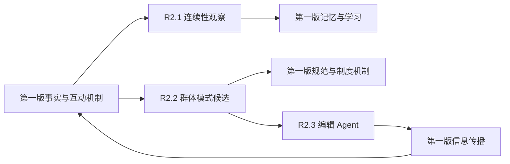

# 环境现实性路线图 2：主体连续性、群体观察与编辑 Agent

## 文档定位与优先级

本文件是 [ENVIRONMENT_REALISM_ROADMAP.md](ENVIRONMENT_REALISM_ROADMAP.md) 的补充，不是第二套
世界架构，也不重新定义第一版已经确立的阶段、机制和不变量。

两份文档的职责如下：

- 第一版路线图是世界事实层、Agent 行动层、社会机制、制度演化和研究治理的主规范。
- 本文件只补充第一版尚未具体展开的四个能力缺口：
  1. Agent 如何发现自身证据与时间连续性的异常；
  2. 系统如何从既有事件中识别跨 Agent 的群体模式；
  3. 校园日报如何从被动解释器演进为受证据约束的编辑 Agent。
  4. 观察层和编辑层产生的假设、线索、候选模式和报道如何长期去重、降权、归档与重激活。
- 如果两份文档出现表述差异，以第一版的事实边界、权限、资源守恒、因果谱系和阶段依赖为准。
- 本文件使用 `R2.1-R2.4` 编号，避免与第一版的阶段 2 和阶段 3 编号冲突。

## 与第一版路线图的对应关系

| 第一版既有章节 | 第一版已经负责 | Roadmap 2 仅新增 |
| --- | --- | --- |
| `3.1.2 记忆、学习与策略变化` | 经历、观察、记忆、信念和策略更新 | 对“缺少预期证据”本身建模，并允许 Agent 调查连续性异常 |
| `3.1.3 非正式规范涌现` | 从重复行为、社会反馈和共享预期形成规范 | 在规范形成前识别统计性群体模式，不替代规范状态机 |
| `3.6.3 接收者自主与多方社会过程` | 多方 session、独立响应和传播证据 | 消费这些事件，计算跨时间、空间和网络的聚集模式 |
| `3.6.6 后验叙事、新闻与可解释性` | 新闻只能解释事实并回链证据 | 把新闻选择过程实现为有目标、记忆和查询工具的编辑主体 |
| `4.1 测量体系与证据完整性` | 指标定义、数据质量和证据边界 | 为群体观察器提供运行时基线，不重新建立研究指标体系 |
| `3.1.2 记忆、学习与策略变化`、`3.6.6 后验叙事、新闻与可解释性` | 记忆、假设、报道和解释都必须保留证据来源 | 补充观察与编辑知识的生命周期状态，不覆盖历史事实 |

## 非目标

本文件不重复或扩写以下内容：

- 不重新定义空间、身体、经济、组织、账本、资源或行动结算。
- 不重做通用记忆衰减、策略学习和反事实学习；这些继续属于第一版 `3.1.2`。
- 不重做社会接触、多方互动和传播；这些继续属于第一版 `2.11` 与 `3.6.3`。
- 不重做规范形成和制度演化；这些继续属于第一版 `3.1.3-3.1.4`。
- 不新增由系统直接宣布的“恐慌、抗议、失忆、互助”等剧情类型。
- 不让日报、LLM 或群体观察器制造底层事实。
- 不定义 Agent 的底层行动选择器。饥饿、疲劳、压力、预算和制度等软约束的多路径决策继续由第一版 `3.6.2A` 负责（包括近期已落地的 **Intra-tick 替代行动选择机制**：当 Agent 主交易报价超过支付意愿或商品库存不足时，系统在同一 Tick 内自动评估并执行有界的替代消费行动，保留失败原因与替代证据）；本文件只允许观察器和编辑 Agent 报道这些机制已经产生的事实、异常和群体模式。
- 不在本文件重复研究治理、校准、隐私和实验设计要求；统一继承第一版阶段 4。

### 最新落地衔接说明 (2026-08-14)
系统已打通外部信息流（`external_information`）与社科学报新闻简报（`newspaper`），基于 `agent_observations` / `agent_beliefs` 实现了“外部事实发布 $\rightarrow$ 渠道暴露 $\rightarrow$ Agent 主观信念更新 $\rightarrow$ 媒体后验报道”的完整证据链，且该过程完全继承受约束的结构化 fallback。

## 当前新增缺口

当前实现已经能够检索已有记忆、保存事件、形成规范候选并从事件生成日报，但仍缺少四种
“观察自身与观察系统”的能力：

1. `retrieve_relevant_memories()` 只排序已有记忆，无法表达“按个人预期本应存在、实际却
   不存在的证据”。
2. 当前群体现象主要依赖事件类型和关键词，尚未比较参与人数、历史基线、传播路径、持续时间
   与共同外部暴露。
3. `classify_campus_news_candidate()` 能作为稳定 fallback，但日报没有独立选题目标、历史
   报道记忆、调查动作和“不报道”决策。
4. 观察层与编辑层会持续产生假设、线索、模式候选和报道，但缺少统一的过期、归档、反证和
   重激活机制。

以下四个工作流只解决这些缺口。

## R2.1 主体连续性与认知缺口

### 目标

让 Agent 能在其可观察范围内发现“证据连续性异常”，但不让系统直接告诉 Agent 已经失忆，
也不让 Agent 读取全局数据库事实。

第一版已经定义“事实经历 → 主观观察 → 记忆与信念 → 策略更新”。本工作流只在“主观观察”
之前补充预期证据及其缺口：

```text
个人日程与历史频率形成证据预期
→ 当前窗口实际证据覆盖不足
→ 生成客观连续性观察
→ Agent 形成多个可修订假设
→ Agent 选择忽略、等待、查阅、询问或调查
→ 调查结果回到第一版记忆与学习闭环
```

### 数据边界

建议新增或扩展以下结构，最终名称可在 schema 设计时调整：

- `agent_expectations`：预期的观察、行动或记录类型，包含时间窗口、基线、置信度和失效条件。
- `continuity_observations`：缺口窗口、实际覆盖率、来源游标、可见范围和客观计算结果。
- `agent_hypotheses`：Agent 对缺口的竞争解释、支持证据、反证、置信度和状态。
- `hypothesis_investigations`：调查动作、资源成本、接触对象、结果及其信念更新引用。

必须保持三者分离：

- 数据缺口是客观测量结果；
- “遗忘、未参与、记录故障或时间异常”是主观假设；
- 调查结果是新的事实或观察。

### 认知权限

Agent 只有在合理接触以下证据时才能察觉连续性异常：

- 自己的日历、日程、行动记录或旧记忆；
- 可访问的设备、档案、校园日报或组织通知；
- 通过真实互动获得的他人证言。

数据库恢复、世界暂停、分支切换和服务故障应留下系统 provenance，但不能自动写入所有
Agent 的主观记忆。

### 验收标准

- 人为移除一段个人记录后，拥有时间证据的 Agent 会提高连续性偏差。
- 不同 Agent 可以对同一缺口形成不同假设，且假设可以被反证和修订。
- 没有相关可观察证据的 Agent 不会凭空察觉缺口。
- 调查会消耗真实时间或资源，并通过第一版行动、记忆和学习机制结算。
- 停机或迁移不会被系统自动包装成 Agent 的个人经历。

## R2.2 群体模式观察器

### 目标

从第一版已经产生的原子行动、多方互动、传播、关系、空间和组织事件中识别统计性聚集。
观察器只产生“模式候选”，不直接产生规范、制度或新闻，也不替参与者决定社会意义。

### 输入

- `world_event_stream` 及其来源、父事件、根事件和分支信息；
- 多方 interaction session、接触和传播路径；
- Agent 位置、角色、组织和关系社区；
- 外部暴露、空间状态、资源与制度变化；
- 第一版阶段 4.1 定义的数据质量和历史基线。

### 通用指标

模式检测至少考虑：

- 独立参与人数及覆盖比例；
- 时间和空间聚集程度；
- 关系社区、角色和组织间的扩散范围；
- 相对个人基线和校园基线的偏离程度；
- 传播速度、持续时间与重复窗口；
- 共同外部暴露、网络传播和偶然同时发生的替代解释；
- 事件来源完整度、重复记录和误报风险。

### 输出边界

建议输出 `group_pattern_candidates`，至少包含：

- 窗口、分支和机制版本；
- 模式使用的特征与历史基线；
- 独立成员集合和来源事件集合；
- 空间、网络及角色覆盖；
- 偏离度、置信度、证据完整度和替代解释；
- `candidate / confirmed / rejected / expired` 等观察状态。

“confirmed”只表示统计模式得到后续证据支持，不表示它已经成为非正式规范。规范仍必须按
第一版 `3.1.3` 检查共享预期、赞同反对、模仿和社会奖惩。

### 验收标准

- 多个独立相似事件能够形成模式候选，单个事件不能冒充群体现象。
- 同一根事件的重复派生记录不会重复计算参与人数。
- 能区分共同外部原因、关系网络传播和随机共现。
- 候选可以因新证据增强、减弱、被拒绝或过期。
- 每个指标和结论都能下钻到来源事件与基线窗口。
- 观察器不可直接修改 Agent 状态、规范、制度或账本。

## R2.3 校园日报编辑 Agent

### 目标

在第一版 `3.6.6` 的“后验叙事与新闻”边界内，将选题过程从关键词排序升级为受证据约束的
编辑主体。编辑 Agent 可以决定报道、等待、调查或不报道，但不能创造底层事件。

### 可用工具

编辑 Agent 只能通过显式工具读取获授权的数据：

- 查询世界事件、事件谱系和群体模式候选；
- 比较当前窗口与历史报道及统计基线；
- 查询关系、空间、组织、制度和资源变化；
- 检查来源可信度、证据覆盖率和相互矛盾的证据；
- 追踪已发布报道的传播范围与后续影响。

### 状态与决策

编辑主体需要保存：

- 编辑目标与公共价值约束；
- 已报道主题、来源和后续更正；
- 待观察线索及其到期条件；
- 选题决策、证据摘要、置信度与拒绝原因。

允许的决策包括：

- `publish`：证据满足事实和公共价值要求；
- `hold`：现象可能重要但证据不足；
- `investigate`：请求额外查询或观察；
- `reject`：重复、低影响、不可验证或涉及不必要隐私。

现有 `classify_campus_news_candidate()` 保留为确定性 fallback。LLM 不可用时，系统仍可根据
来源事件和通用指标生成事实摘要，但不得补写因果。

### 媒体反馈边界

发布后的报道作为带来源的信息主张进入第一版 `2.9` 的传播机制。Agent 是否接触、相信、
转述或反对报道，继续由接触证据、信任和既有信念决定。媒体影响制度议程时，仍必须进入
第一版 `3.1.4` 的提案、协商、授权和复核流程。

本文件不另建媒体专用的传播或制度状态机。

### 防系统诱发的群体虚构机制 (Anti-System-Induced Collective Confabulation)

**核心原则：允许社会形成错误信念，但不允许系统凭空制造历史事实。**

在多智能体社会仿真中，系统必须区分两类表面相似但本质不同的现象：

一类是由信息不对称、利益冲突、选择性传播、多元无知或社会认同所形成的谣言、误解与虚假共识。这类现象属于可观测的社会涌现，应被允许发生并完整记录。

另一类是由大模型幻觉、记忆断层、上下文污染或系统状态不一致所产生的虚构事实。这类错误不属于社会机制的自然结果，必须受到系统约束，避免其被权威媒体或公共信息渠道放大为集体记忆。

为此，系统将严格区分：

* **事实层**：由事件账本、世界状态和行为日志确认的客观记录；
* **认知层**：Agent 对事实的主观理解、记忆和判断；
* **传播层**：Agent 与媒体对信息的转述、评论和扩散。

媒体 Agent 不得自行创造或补全事实。当某项事实性主张无法通过事件账本或可信来源完成溯源时，媒体不得将其作为已确认事实发布；但可以在明确标注来源与验证状态的情况下，将其作为“未经证实的声明”“传闻”或“争议信息”进行报道。

该机制并不消除谣言或虚假共识，而是确保这些现象源自 Agent 之间真实的信息传播和社会互动，而不是由系统幻觉直接注入公共事实层。由此，研究人员能够区分社会涌现与系统误差，提升实验的可解释性、内部效度、可追溯性与可复现性。

### 验收标准

- 每项报道事实都能回链到事件、模式候选或统计窗口。
- 事实、编辑解释和不确定性在数据结构中分开保存。
- 同一事实可因编辑目标和既往报道不同而产生不同选题决定。
- “没有显著事件”“继续观察”和更正报道均为合法结果。
- 报道不能直接修改 Agent 信念；只有实际暴露与接收者响应才能产生影响。
- LLM 不可用时不丢失事实层，只降低文本表达丰富度。

## R2.4 观察与编辑知识生命周期

Roadmap 2 产生的对象包括连续性观察、Agent 假设、群体模式候选、编辑线索、报道、更正和
拒绝原因。它们不能只新增，也不能被新结论覆盖旧结论；否则长期运行后，观察层会积累大量
互相冲突、过期或只在旧规则版本成立的知识。

本节只管理观察层和编辑层知识的生命周期，不管理世界事实，也不替代 Roadmap 1 的研究治理。
事实事件、账本、库存、轨迹和记忆仍由第一版机制负责。

通用状态包括：

```text
active / under_review / contested / weakened / superseded / expired / archived / reactivated / rejected
```

### 适用对象

- `agent_hypotheses`：主体对连续性缺口、他人意图或环境异常形成的竞争假设。
- `group_pattern_candidates`：群体观察器产生的统计模式候选。
- `editorial_leads`：编辑 Agent 的线索、调查计划、等待原因和拒绝原因。
- `published_claims`：已报道主张、更正、撤回和后续影响。

### 生命周期规则

- 任何状态变化都必须保存来源证据、操作者或触发机制、原因、时间窗口和规则版本。
- 支持证据和反对证据对称保存；失败调查和被反证假设不能静默删除。
- 过期或归档知识不默认进入新报道或新观察结论，但可在注明状态后被检索。
- 旧规则版本、旧数据口径或旧模型版本产生的观察结果必须能被识别。
- 重激活必须绑定新证据，不能因为 LLM 重新表述而自动恢复为有效线索。

验收标准：

- Agent 不会每次对话都重新发明同一个已归档假设。
- 编辑 Agent 不会重复报道已拒绝或已更正的线索，除非出现新证据。
- 群体模式候选可以因新证据增强、削弱、被替代、过期或重激活。
- 归档不等于删除；研究导出可以看到知识如何被相信、质疑、替代和放弃。

## 集成数据流



四个工作流只添加观察、解释、选择和生命周期管理能力，不建立平行事实层。所有写入必须继续携带
`branch_key`、时间窗口、来源游标、机制版本和事件谱系。

## 实施顺序与依赖

### R2.1：主体连续性

依赖第一版事件谱系、个人记忆、日程和行动日志稳定。可以独立实施，不依赖群体观察器。

### R2.2：群体模式观察器

依赖第一版多方 interaction、传播和空间事件具备稳定身份与根事件引用。若 `3.6.3` 尚未
完全迁移，先支持证据完整的事件类型，并明确标记覆盖率，不用推断补齐缺失互动。

### R2.3：编辑 Agent

依赖 R2.2 提供模式候选，但可以先读取单个高价值事实。编辑 Agent 上线前，现有日报分类器
继续作为主路径；上线后降为 fallback。

### R2.4：观察与编辑知识生命周期

依赖 R2.1-R2.3 至少产生稳定的假设、模式候选、编辑线索或报道对象后再启用。可以先作为
轻量状态字段和版本记录接入，不改变 R2.1-R2.3 的事实输入和决策边界。

推荐顺序：

```text
R2.1 主体连续性
→ R2.2 群体模式观察器
→ R2.3 编辑 Agent
→ R2.4 观察与编辑知识生命周期
```

制度反馈、规则创造和长期研究不作为 Roadmap 2 的新增阶段，继续由第一版负责。

## 跨工作流验收

- 相同快照、随机种子、配置和输入可以重放关键观察与来源谱系。
- Agent 不能基于未观察到的证据形成确定结论。
- 连续性缺口只形成可修订假设，不自动成为世界事实。
- 群体候选必须有参与者、时间窗口、历史基线和来源事件。
- 编辑报道严格区分事实、解释与不确定性。
- 观察假设、模式候选和编辑线索支持版本化、过期、归档、重激活和反证记录。
- 新能力不绕过第一版账本平衡、资源守恒、权限、状态机与制度程序。
- LLM 不可用时四个机制仍可运行，只降低解释和文本丰富度。
- 新增表、事件和指标必须进入快照、分支、导出、数据字典和失败审计。

## 文档维护规则

- 第一版路线图不再因本文件的实现细节而扩写，只在必要时增加交叉引用。
- Roadmap 2 不复制第一版机制说明；需要背景时引用明确章节。
- 新需求先判断属于事实机制还是观察/解释能力：前者回到第一版，后者才进入本文件。
- 每项 Roadmap 2 任务必须标注所依赖的第一版章节、输入事实和不得修改的不变量。
