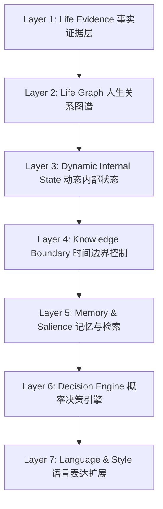
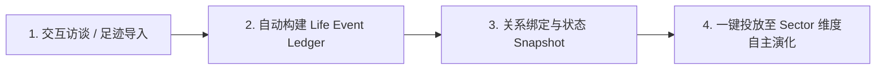

# World2 Person Model Engine 架构设计规范

> **核心哲学**：不靠“在 Prompt 里塞 1000 个静态设定”或“用全量文本硬练大模型”假扮演技，而是基于**真实可观察的人生证据**，构建能够在未知的空间与社交情境下、以接近真实个体的认知方式与价值取舍做出概率决策的**动态人格模型（Person Model Engine）**。

---

## 💡 为什么需要全新的 Person Model Engine？（以 Steve Jobs 为例）

假设我们要构建一个 **Steve Jobs Agent**：

### 传统的简单做法
把乔布斯的传记、采访、演讲、邮件、产品发布会、同事回忆等资料全部打包塞进提示词：
> *"你现在是 Steve Jobs，请以乔布斯的身份回答问题。"*

**结果**：Agent 很可能会像乔布斯一样说话（口头禅、极简、激情满满），但它**不一定像乔布斯一样思考**。它很容易沦为一个 **"Wikipedia + 乔布斯语气模仿器"**。

### 真正的 Person Model 目标
真正的数字人 / 人格系统要解决的核心问题是：**为什么这个人在那个特定的时间点，面对特定的人与约束，会做出那个决定？**

因此，我们不追求“数据够多就能复制一个乔布斯”，而是：
> 基于可观察的人生证据，建立一个能够在未知情境下，以接近该真人的认知方式、价值取舍和行为倾向做出反应的**概率推演模型**。

---

## 1. 拟真层次与核心目标 (Target & Fidelity Levels)

在构建 Person Model 时，我们将仿真能力划分为三个层次：

* **Level 1 — Mimicry (语言模仿)**：仅能模仿该人物的口吻、口头禅与语气风格（例如“说话像乔布斯”）。*实现成本低，但缺乏深度决策逻辑。*
* **Level 2 — Behavioral Twin (行为孪生)**：面对已知类型的情境，其选择与决策高度接近真实人物在历史中的选择（例如面对产品缺陷时的典型态度）。*具备历史契合度，但缺乏未知场景的泛化能力。*
* **Level 3 — Generative Person Model (生成式人模型)**：**面对乔布斯从来没有遇到过的全新世界与陌生情境（例如被置入 2026 年的平行宇宙空间），他仍能展现出符合其底层价值取舍、认知模型与决策结构的连贯泛化行为。**（这是 World2 Person Model Engine 的终极目标）。

---

## 2. 7 层动态人模型架构 (7-Layer Person Model Engine)

我们将 Person Model Engine 划分为 7 个逻辑层，从底层数据证据逐层推演至最高层的决策与表达：



---

### Layer 1: Life Evidence (事实证据层)
* **原则**：事实与 AI 的解释必须分开。不先总结“他是完美主义者”，而是尽可能保存未污染的原始历史证据。
* **案例 (Jobs)**：
  * `1972`：Reed College 退学，旁听书法课，与 Wozniak 保持频繁联络。
  * `1974`：任职 Atari，前往印度旅行，受禅宗思想影响。
  * `1976`：Apple 成立，与 Wozniak / Markkula 组建早期团队。
  * `1983-1985`：Macintosh 团队阶段，与 Sculley 发生控制权冲突，被 Apple 排挤出局。
* **数据结构 (Life Event Ledger)**：
  ```yaml
  Evidence:
    event: "Macintosh 团队与 Sculley 发生产品控制权冲突"
    timestamp: "1985-05"
    source: "Steve Jobs 授权传记 / 董事会会议记录"
    source_type: "first_hand_and_third_party"
    quote: "..."
    reliability: 0.95
    confidence: 0.92
  ```

---

### Layer 2: Life Graph (人生关系图谱)
* **原则**：一个人的人格不能脱离他“正在面对谁”这个上下文。
* **动态关系**：将人与人、人与组织的关系建模为随时间改变的动态函数 `Relationship(t)`（包含信任 `trust`、依赖 `dependency`、权力 `power`、冲突 `conflict` 等）。
* **案例 (Jobs)**：
  * `Jobs ↔ Wozniak`（技术互补、早期高度信任、后期理念分歧）
  * `Jobs ↔ Sculley`（从极力拉拢、信任交棒，到 1985 年激烈的控制权对抗）
  * `Jobs ↔ Jony Ive`（2000s 极度默契的设计共鸣与高度信任）

  模拟“1984 年的 Jobs 面对 Sculley”与“2004 年的 Jobs 面对 Jony Ive”，绝不是同一个人格 Prompt 换个名字，而是基于完全不同的关系上下文。

---

### Layer 3: Dynamic Internal State (动态内部状态层)
* **原则**：人格不是一成不变的固定参数。乔布斯 20 岁与 50 岁绝不是同一个状态。
* **反强行标签**：绝不硬编码固定参数 `perfectionism = 0.93, risk_tolerance = 0.88` 用一辈子。
* **时间切片状态 (`PersonState(t)`)**：
  * **Values & Goals**：追求极简设计、绝对控制权、改变世界的使命感。
  * **Beliefs & Risk Tolerance**：对既有规则的打破倾向、对产品完整性的执念。
  * **状态转移**：`经历事件 → 逻辑反思 → 状态更新`。被 Apple 赶出局、创立 NeXT 与 Pixar 的挫折与磨砺，会动态改变他 40 岁时的风险偏好与领导力模型。

---

### Layer 4: Knowledge Boundary (时间边界控制层)
* **原则**：未来信息绝不能泄漏给过去的 Agent。
* **时间截断 (`KnowledgeCutoff`)**：
  * 假设正在模拟 **1984 年 1 月的 Steve Jobs (`Jobs@1984`)**；
  * Agent 数据库中虽然已有全部资料，但**绝对无法访问** 1985 年自己会被赶出 Apple、NeXT 的困难、Pixar 的成功或 1997 年回归 Apple 等未来记忆。
  * **收益**：避免 Agent 表现出“命中注定”或后视镜视角的预知感，确保历史切片的纯粹性。

---

### Layer 5: Memory & Salience (记忆编码与检索层)
* **原则**：经历过某件事，不等于每次做决定都会想起它。
* **显著度与衰减**：实现从 `Life Evidence` 到 `Encoded Memory` 的显著度 (Salience) 衰减与动态检索 (Retrieval)。
* **案例 (Jobs)**：乔布斯 1972 年在 Reed College 上书法课的记忆，只有在 1983 年设计 Macintosh 多字体排版系统这一特定情境下，才会被显著激活检索，而非在日常所有对话中重复提及。

---

### Layer 6: Decision Engine (概率决策引擎)
* **原则**：真人不是确定性函数。同一个人在睡眠不足、刚吵完架或拿到新信息时可能做出不同选择。
* **概率分布输出**：结合当前情境 (Situation)、已知信息 (Knowledge)、相关记忆 (Memories)、目标偏好 (Goals) 与关系上下文，计算候选行动的概率分布：
  ```text
  Situation: 董事会要求延期 Macintosh 发布以降低风险
  Candidate Actions:
    A. 强硬拒绝并威胁辞职 (54%)
    B. 闭门妥协但私下加速排期 (28%)
    C. 寻求 Markkula 等核心董事游说 (13%)
    D. 接受延期计划 (5%)
  Chosen: Action A
  ```
  这种随机性不是 Bug，而是 Human Fidelity（人类拟真度）的关键组成部分。

---

### Layer 7: Language & Style (语言表达与风格层)
* **原则**：决策优先于表达。先决定“怎么选”，再决定“怎么说”。
* **解耦设计**：
  $$\text{Person Model (人模型)} \longrightarrow \text{Decision Policy (决策策略)} \longrightarrow \text{Language Style (语言风格)}$$
  语言风格放在最后通过 Prompt 模板、LoRA 风格适配器或 Voice Model 完成。不让语言风格承担人格建模的重任。

---

## 3. 工程实现与架构映射 (Engineering Realization)

为支持大规模 (Scalable) 运行 10 万+ 数字居民，我们采用 **“共享大语言模型基座 (Foundation Model) + 独立 Person 数据挂载”** 的解耦架构：

```
                 Foundation Model (共享基座模型)
                       │
              Person Model Engine
                       │
       ┌────────────────┼─────────────────┐
       ↓                ↓                 ↓
  Life Event Ledger  Temporal Self Model  Relationship Graph
       ↓                ↓                 ↓
Decision Episodes    Cognitive Policy   Validation Engine
       └────────────────┼─────────────────┘
                        ↓
                 World2 Agent Policy
```

### 架构模块与 7 层模型对照映射

| 工程模块 | 对应 7 层架构 | 乔布斯 (Jobs) 示例说明 |
| :--- | :--- | :--- |
| **Life Event Ledger (人生事件账本)** | Layer 1: Life Evidence | 存储 1955-2011 年间未污染的原始事件与言论文本，带可信度与时间戳。 |
| **Relationship Graph (动态关系图谱)** | Layer 2: Life Graph | 记录 Jobs 与 Wozniak、Sculley、Jony Ive 等节点随时间改变的信任/冲突权值。 |
| **Temporal Self Model (时间化状态模型)** | Layer 3 & 4: Dynamic State & Boundary | 挂载 `Jobs@1984` 状态快照，并设置 `KnowledgeCutoff = 1984-01-01` 屏蔽未来记忆。 |
| **Decision Episodes (决策场景数据集)** | Layer 6: Decision Engine | 将 500+ 个历史关键决策整理为 `情境 → 知悉 → 选项 → 抉择 → 结果` 决策链。 |
| **Cognitive Policy (认知决策策略层)** | Layer 5 & 6: Memory & Decision | 调度 Foundation Model，在运行时完成情境感知与概率选项选择。 |
| **Validation Engine (回测与验证引擎)** | 模型评估与验证 | 隐藏 1985 年关键决策数据，测试 `Jobs@1984` Agent 预测真实历史选择的准确率。 |

---

## 4. 模型评估与实验方案 (Validation & Evaluation Engine)

为避免凭感觉说“挺像乔布斯”，Person Model Engine 采用严格科学的**时间 Holdout 行为预测实验 (Temporal Holdout Behavior Prediction)**：

### 1. 滚动 Holdout 预测实验
1. **构建 `Jobs@25`**：仅注入 25 岁之前的历史数据。
2. **预测 25–30 岁行为**：将其置入 25–30 岁真实发生的历史情境中运行 100 次，生成决策概率分布。
3. **检验匹配度**：将预测分布与历史上乔布斯真实做出的选择进行交叉熵/匹配度评估。
4. **滚动推演**：依次构建 `Jobs@35` 预测 35–40 岁，`Jobs@45` 预测 45–50 岁。

### 2. 消融实验 (Ablation Study)
通过分级消融验证各组件对行为拟真度的实际贡献：
* **Variant A**：仅保留人口统计特征 (Demographic Persona)
* **Variant B**：仅保留传记总结 Prompt ("你现在是 Steve Jobs")
* **Variant C**：全量 RAG 文档检索 (Full RAG)
* **Variant D**：Timeline 线性事件链
* **Variant E**：Timeline + Dynamic Relationship Graph
* **Variant F**：Timeline + Relationship + Dynamic Beliefs/Values
* **Variant G (Full Engine)**：完整 Person Model Engine (包含时间隔离与概率决策)

通过对比变体 A 到 G 的历史决策预测准确率，科学验证 Person Model Engine 在行为拟真与泛化推演上的显著优势。

---

## 5. 真人数据接入与用户投放流程 (Real-Person User Onboarding)

Person Model Engine 天生支持将真实用户的数据“数字孪生化”并“投放 (Deploy)”至 World2 平行宇宙中。用户**无需懂任何编程技术，也不需要微调大模型**，仅需完成以下 4 步无缝体验：



### 步骤 1：轻量数据接入 (Data Ingestion)
* **AI 引导式深度访谈 (Interactive Interview)**：由系统内置的“访谈助手”与用户进行 15–30 分钟的对话，针对个人经历、转折点、价值选择与兴趣偏好进行提问（类似于 Stanford 给 1,052 个真人做深度访谈生成数字孪生的方法）。
* **数字足迹导入 (Digital Footprint)**：用户可自愿导入个人日志、博客文章、工作总结或社交平台公开文本。
* **事实账本自动生成**：Person Engine 自动将文本抽取解耦为带时间戳与可信度梯度的 `Life Event Ledger`（人生事件账本）。

### 步骤 2：社会关系与上下文绑定 (Social Graph Binding)
* **指定关系节点**：用户在前端界面勾选或关联自己在 World2 中的朋友、同事或特定 Agent 实体。
* **生成关系变权**：系统自动为该用户建立初始 `Relationship Graph`，赋予初始信任度与依赖度参数。

### 步骤 3：当前状态锚定 (PersonState Snapshot)
* 锁定用户在当前投射时刻的状态快照（`PersonState@Now`）：
  * **目标 (Goals)**：例如“想在 World2 Sector-01 探索算法研学并结识新朋友”。
  * **风险偏好与控制欲**：保守稳健型 / 极客探索型。
  * **日常习惯**：喜好的空间节点（如偏好图书馆研学、食堂用餐时间）。

### 步骤 4：Sector 维度一键投放与日常简报 (Dimensional Deployment & Briefing)
* **一键投放**：点击 **“一键投放分身至 Sector-01”**，用户数字分身即可作为自治 Agent 融入 World2 平行空间中独立运作。
* **分身日志与简报 (Digital Twin Daily Log)**：
  * 用户每天可拉取 **“分身平行日记”**（例如：*“你的数字分身今天在清华图书馆与唐晓棠讨论了 20 分钟 AI 算法，随后在清芬园补充了能量。”*）。
  * 用户可随时在前端微调或纠偏分身的状态信念（`Beliefs Update`），实现真实自我与数字孪生的持续共生演化。