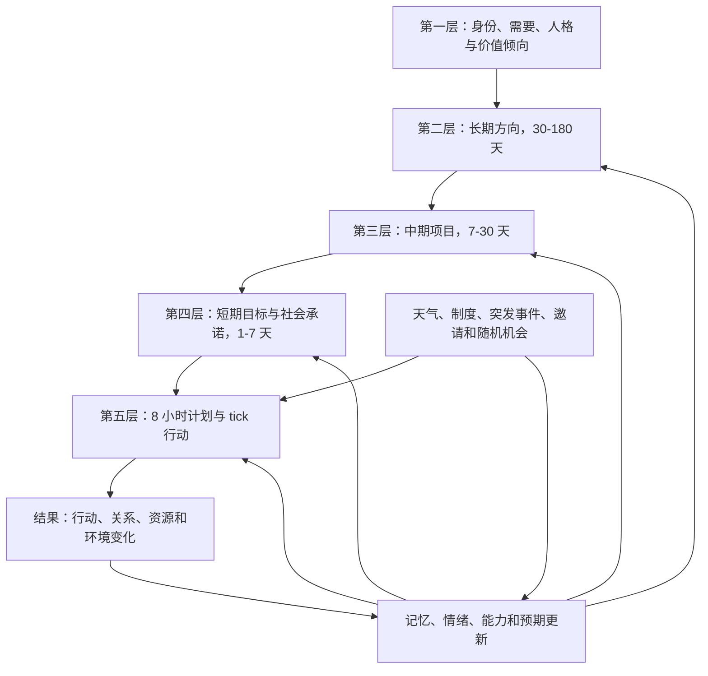
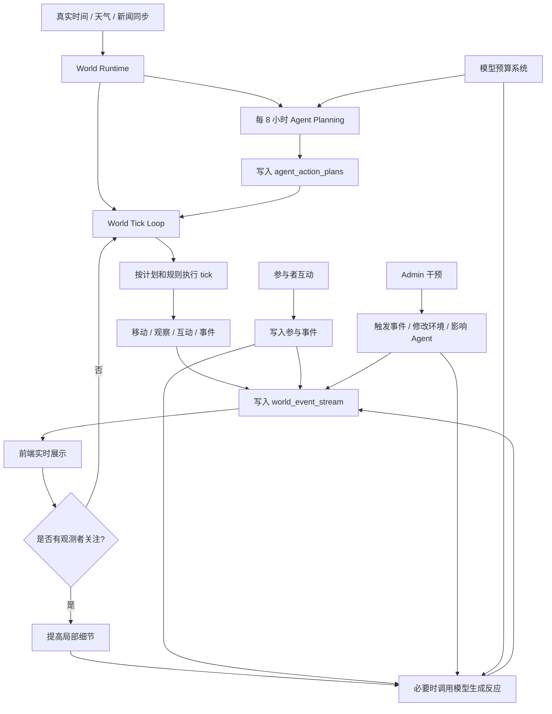

# 校园平行世界架构演进愿景

我很喜欢这个方向。你想要的其实不是“点一下模拟一天”，而是一个**持续运行的平行校园世界**：用户进入时，不是在操作一个工具，而是在观察一个已经自行运转的世界。

我会这样设计。

## 核心概念
把系统从“按钮触发模拟”升级成三层：

```text
世界时钟 World Clock
持续事件流 Event Stream
权限分层 Interaction Layer
```

进一步拆分为四类运行机制：

```text
8 小时计划 Planner
低成本 tick Runner
注意力触发 Attention Triggers
模型预算 Model Budget
```

普通用户默认是观察者，以观察为主；参与者可以和虚拟世界互动；admin 才能干预天气、事件、Agent、模拟速度、外部资讯、重置/回滚等。观测者打开页面、参与者互动、admin 干预都可以触发额外模型调用，但这些调用必须受每日预算和优先级控制。

## 真实世界还原能力

这个系统不应该把真实世界理解为一套一成不变的规则。校园生活更接近“约束下的随机系统”：作息、空间开放、天气、课程、关系和制度会限制人的行动范围，但个体仍然会因为情绪、偶遇、信息、观察者关注和突发事件而偏离计划。

更完整的环境缺口、优先级和验收标准见 [校园真实环境模拟路线图](ENVIRONMENT_REALISM_ROADMAP.md)。本节只保留 World Runtime 需要承接的核心能力摘要。

因此，World Runtime 需要补齐以下核心能力：

1. **作息与制度约束**
   - 上课、用餐、宿舍、图书馆、自习、社团、校务处等空间都有高低活跃时间。
   - 空间有开放、关闭、维护、满员状态。
   - 夜间不是所有行为都禁止，但低概率异常需要有原因。

2. **空间可达性与活动场景**
   - Agent 不只是“位于某个地点”，还应处在具体活动场景中，例如排队、上课、休息、运动、采购、值班、讨论。
   - 建筑内的人可以用头像和状态表达，跨建筑活动才表现为移动。
   - 空间拥挤度、天气和事件会改变空间吸引力。

3. **带噪声的个体决策**
   - 8 小时计划提供倾向，但 tick 执行时可以偏离。
   - 偏离原因包括精力、心情、观察者关注、社交邀请、天气、突发事件、空间关闭、拥挤和重要记忆。
   - 随机性必须有边界：允许临时改计划，但不能大量产生明显违背常识的行为。

4. **环境到行为的因果反馈**
   - 天气影响操场、商业街和通勤。
   - 考试压力影响图书馆、教学楼和睡眠。
   - 活动热度影响操场、商业街和社交行为。
   - 资源压力影响食堂、图书馆、宿舍等空间体验。

5. **社交网络与群体传播**
   - 信息不是全员瞬间知道，而是沿关系、组织、地点和共同经历传播。
   - 关系变化应来自互动、合作、冲突、帮助和竞争。
   - 群体事件应能形成聚集、分散、模仿、协作和意见分化。

6. **外部世界扰动**
   - 真实天气、新闻、校园公告和社会事件持续进入世界。
   - 外部信息需要按相关性影响不同 Agent，而不是所有人同等响应。
   - 外部扰动应能改变计划、空间热度、讨论主题和新闻生成。

7. **观察者与参与者影响**
   - 观察者进入世界时，会提高被观察 Agent/地点的细节密度。
   - 参与者互动可以成为局部事件，影响 Agent 感知和后续计划。
   - admin 干预需要明确记录，避免和自然演化混淆。

8. **可复现实验数据层**
   - 实验运行需要 `experiment_runs` 统一标识。
   - 关键时刻需要 `world_snapshots` 保存世界状态。
   - 研究导出应形成 `agent_tick`、`agent_day`、`space_time`、`relationship_daily`、`observer_attention` 等派生数据集。
   - 随机性需要记录随机种子、模型版本、规则版本和外部数据版本。

当前实现策略是：先用低成本规则建立“现实边界”，再在关键节点用模型生成细节和例外。这样既保留随机性，也能控制成本和可解释性。

## 涌现式社会关系模型

系统不应把复杂社会关系提前设计成固定剧本。例如不应简单预设“甲和乙一定会成为朋友”“某两人一定是亲密关系”。更合适的原则是：

```text
不设计关系结果，只设计关系生成的条件。
让世界先发生，让关系后来被解释。
```

也就是说，系统提供连续时间、共享空间、重复相遇、共同任务、资源依赖、信息不对称、记忆、情绪、个体差异、制度约束、偶然事件和外部压力；关系从这些条件中逐步生成。

### 关系不是单一事实

真实社会关系不能只映射成一条边和一个分数。同一组关系至少有三层：

1. **互动证据**
   - 共处、聊天、协作、帮助、竞争、冲突、资源交换、共同任务、共同记忆。
   - 这些是最底层、最接近可观察事实的数据。

2. **动态关系状态**
   - 熟悉度、好感、信任、合作、竞争、冲突、紧张、依赖、亲密、义务、权力差、信息差。
   - 这些是从互动证据中持续更新的关系指标。

3. **多视角关系解释**
   - A 认为自己和 B 是朋友。
   - B 认为只是合作关系。
   - 旁观者觉得他们最近走得很近。
   - 系统研究者视角只能说：当前证据支持某些候选解释，并附置信度。

因此，关系类型不应该是永久字段，而应是从历史证据生成的**涌现标签**：

```json
{
  "label": "合作伙伴",
  "confidence": 74,
  "candidates": [
    {"label": "合作伙伴", "confidence": 74},
    {"label": "可信关系", "confidence": 68},
    {"label": "熟人关系", "confidence": 55}
  ],
  "evidence": [
    "第24天：在图书馆共同完成资料整理",
    "第25天：围绕课程任务发生协作"
  ],
  "boundary": "这是从互动证据和关系指标生成的当前解释，不是预设身份，也不是确定事实。"
}
```

### 映射真实世界的边界

这个模型不是完整复刻真实世界。真实关系还包含身体性、家庭史、阶层、文化规范、沉默、羞耻、误解、叙事重写和不可还原的偶然性。系统能做的是把其中一部分机制变成可计算、可观察、可复现的实验沙盘。

更准确的目标不是：

```text
复制真实社会。
```

而是：

```text
构建一套条件，让社会关系可以在连续世界中被生成、被感知、被误解、被改变，并被研究者回溯分析。
```

### 当前 v3 落地边界

当前阶段已经把涌现关系拆成“证据、解释、认知”三层。已有关系表继续保留，新表用于补足研究所需的细粒度社会过程：

- `relationships`：基础有向边权。
- `relationship_dynamics`：好感、信任、合作、竞争、冲突、紧张、互动次数。
- `relationship_change_events`：关系变化证据。
- `world_event_stream` / `simulation_action_logs` / `memories`：行动和共同经历证据。
- `social_interaction_events`：把共处、私聊、帮助、资源交换、共同任务、冲突等细粒度互动独立记录。
- `social_relation_interpretations`：保存某个时刻的关系解释，包括候选标签、置信度、证据和解释边界。
- `social_beliefs`：记录 Agent 对关系的知道、怀疑、误解、否认和公开/隐藏状态，当前 v3 先完成结构预留，后续再接入更多认知更新逻辑。

前端人物关系图不再只显示“普通联系/合作伙伴/冲突风险”，而是显示：

- 当前涌现解释。
- 候选解释与置信度。
- 支撑证据。
- 解释边界。

当前运行时代码已接入：

- 每次 `evolve_relationship()` 触发时，自动写入一次 `relationship_change_events`。
- 同时写入 `social_interaction_events`，保留互动类型、强度、正负效价、可见性、公开状态和证据。
- 同时写入 `social_relation_interpretations`，保存当时的涌现关系解释快照。

这些新增表会涉及 Supabase schema 迁移。本地 schema 和 `docs/supabase_schema.sql` 已更新；线上 Supabase 需要在 SQL Editor 中执行新增表和索引后才会对齐。

## v3 真实感补齐边界

v3 不是宣称“完全复刻真实校园”，而是把六类缺口变成可运行、可配置、可校准的基础模块：

| 缺口 | v3 落地方式 | 后续增强 |
| --- | --- | --- |
| 更细的日程制度 | `campus_schedule_rules` 保存角色、动作、地点、小时段、考试压力和随机噪声；默认覆盖深夜休息、早餐、上课、午餐排队、考试自习、社团活动、商户营业、后勤巡查。 | 接入真实课程表、门禁、校历、节假日和考试周配置。 |
| 更丰富的行动类型 | 自主循环支持 `attend_class`、`queue`、`consume`、`rest`、`club_activity`、`conflict`、`collaborate`、`late`、`request_leave` 等动作，并写入不同事件类型。 | 为每类动作增加资源消耗、持续时间、失败概率和前端动画。 |
| 更强的因果链 | `world_causal_weights` 把天气、降雨、考试压力、活动热度、资源压力、人流等指标映射到地点/动作权重。 | 做成可视化参数面板和数据驱动校准。 |
| 群体行为 | tick 收尾会低频生成 `crowd_transmission`、`group_diffusion`、`organization_mobilization`，表达拥堵传导、资讯扩散和组织动员。 | 增加谣言失真、从众阈值、组织成员响应和跨地点传播路径。 |
| 个体差异 | 性格、目标、身份和资源进入感知上下文，并通过 trait bias 影响社交、学习、常规、风险、服务倾向。 | 引入稳定人格量表、资源约束和长期学习权重。 |
| 数据校准 | 新增 `calibration_observations` 和 `calibration_reports`，支持录入真实/调研观测并生成仿真偏差报告。 | 接入真实校园数据源、参数拟合和实验质量自动报告。 |

v3 的核心原则是“**约束 + 概率 + 可解释偏离**”：制度和空间决定边界，因果权重决定倾向，随机噪声产生变化，模型负责解释关键例外。

### 结构化人格维度

Agent 的 `residents.personality` 保留为人类可读描述，`agent_profiles.strategy.personality_traits` 保存 0-100 的结构化维度，用于运行时决策：

| 维度 | 含义 | 影响 |
| --- | --- | --- |
| `extraversion` | 外向性 | 社交、社团、公开活动概率 |
| `conscientiousness` | 责任心/自律 | 上课、自习、按计划执行概率 |
| `emotional_stability` | 情绪稳定性 | 降低压力扰动和冲突概率 |
| `risk_tolerance` | 风险偏好 | 创业、试错、偏离计划、冲突概率 |
| `rule_orientation` | 规则意识 | 遵守开放时间、校务规则、低风险行为 |
| `social_need` | 社交需求 | 聊天、协作、群体活动概率 |
| `competitiveness` | 竞争倾向 | 考试、就业、资源竞争下的行动强度 |
| `empathy` | 共情能力 | 帮助、倾听、协作、心理支持概率 |
| `autonomy` | 自主性 | 独立行动、探索、主动调整计划概率 |
| `stress_sensitivity` | 压力敏感度 | 考试压力、拥挤、负面事件下的反应强度 |

这些维度不是诊断标签，只是仿真参数。文本性格负责可读性，结构化人格负责可计算性。

## 五层目标与行为轨迹

World Runtime 的个人自主性采用五层结构。这里的“层”不是五套互不相关的脚本，而是从稳定倾向到实际行动的连续约束链：



### 第一层：稳定倾向

时间尺度为数月到数年，主要来自 `residents` 和 `agent_profiles`：

- 身份、角色、资源和能力。
- 人格、价值偏好、风险倾向和社会需要。
- 生理与心理需要，如休息、安全、归属、成就和自主。
- 已形成的关系、社会位置与制度约束。

这一层不直接输出“下一步去哪里”，而是长期影响目标生成、坚持程度、冲突处理和随机选择。稳定倾向也不是永远不变，只有持续经历、重大事件或长期学习才能缓慢改变它。

### 第二层：长期方向

时间尺度建议为 30-180 天，例如“争取奖学金”“建立稳定客源”“改善宿舍关系”。长期方向允许并存、冲突、暂停、失败和替换，不能被一次 `move` 或 `observe` 直接判定为显著推进。

系统使用 `agent_goals.horizon = long` 保存长期方向。旧 `long_term_goals` 会迁移为长期层并保留 `legacy_long_term_goal_id`，兼容已有接口和数据。

### 第三层：中期项目

时间尺度建议为 7-30 天，是长期方向的可执行阶段，例如：

```text
长期方向：争取本学期奖学金
中期项目：三周内完成课程论文
```

中期项目通过 `agent_goals.parent_goal_id` 关联长期方向。它可以来自 Agent 主动分解，也可以由课程、组织任务、关系变化或突发机会生成。

### 第四层：短期目标与社会承诺

时间尺度建议为 1-7 天，例如“本周完成文献综述”“周三帮助同学排练”。两者需要区分：

- 短期目标是 Agent 想完成的结果，保存为 `agent_goals.horizon = short`。
- 社会承诺是对他人、组织或制度负有的义务，保存到 `agent_commitments`。

社会承诺具有对象、重要性、弹性、可见性和截止时间。违约不仅影响目标进度，也可能改变信任、声誉、情绪和后续机会。

### 第五层：计划与实际行动

每 8 小时由 `agent_action_plans` 保存预期行动，tick 决策负责执行或偏离。每个计划步骤应关联长期、中期和短期目标，并在 `plan_outcomes` 中保存：

- 原计划与实际行动。
- 是否按计划执行。
- 偏离类型与原因。
- 行动结果及其证据。
- 对目标、关系和资源的真实影响。

连续行动会在 `trajectory_episodes` 中整理为阶段轨迹，例如“准备考试”“参与社团”“关系修复”。轨迹同时保存 planned summary 与 actual summary，避免把事后日志误当成事前计划。

### 目标之间的关系

目标不是单线任务树。`goal_dependencies` 支持：

- `supports`：一个目标促进另一个目标。
- `requires`：存在前置条件。
- `conflicts`：时间、资源或价值发生冲突。
- `competes`：争夺同一时间、金钱或注意力。
- `replaces`：新目标取代旧目标。

每次目标创建、重排、暂停、放弃或完成，都在 `goal_revisions` 中保留修改前后状态、触发原因和证据。研究者因此能够区分“Agent 改变了目标”和“Agent 只是暂时没有执行”。

### 真实感与随机性

真实行动不是确定性的最优规划。候选行动应由下列因素共同打分，再进行带温度的概率采样：

```text
行动倾向 =
目标收益
+ 承诺压力
+ 习惯与人格偏置
+ 社会影响
+ 环境可行性
+ 近期记忆
- 时间、金钱和精力成本
- 风险与目标冲突
+ 有边界的随机扰动
```

随机性必须满足三个约束：

- 有边界：不能让关闭的教学楼或不可能的资源凭空可用。
- 有连续性：同一人的人格、习惯和经历会让概率长期保持差异。
- 可解释：`plan_outcomes.deviation_reason` 记录天气、邀请、拥挤、疲劳、拖延、机会或自主改变等原因。

因此，同一 Agent 在相同环境下不必每次做出完全相同的选择，但也不会像重新掷骰子一样失去人格连续性。

### 更新频率与模型预算

| 层级 | 建议检查频率 | 主要执行方式 |
| --- | --- | --- |
| 稳定倾向 | 重大事件或每 30 天 | 规则聚合，极少调用模型 |
| 长期方向 | 每 7 天或转折事件 | 规则筛选后由模型复盘 |
| 中期项目 | 每天或项目事件 | 规则维护，必要时模型分解 |
| 短期目标/承诺 | 每个 8 小时窗口 | 规则与模型共同排序 |
| 计划/tick 行动 | 8 小时生成计划，每 tick 执行 | 计划复用、规则执行、关键偏离调用模型 |

20 个 Agent 每天生成 3 次 8 小时计划约为 60 次模型调用。中期复盘、重要偏离和观察者触发采用条件调用，整体仍应受每日 500 次预算约束。预算耗尽后继续使用规则、概率采样和已有计划运行，不能停止世界。

### 数据表边界

| 数据表 | 作用 |
| --- | --- |
| `agent_goals` | 统一保存长期、中期、短期目标及父子层级 |
| `goal_dependencies` | 保存目标之间的支持、前置、冲突和替代关系 |
| `goal_revisions` | 保存目标产生、调整、暂停、放弃和完成的历史 |
| `agent_commitments` | 保存对个人、组织和制度的社会承诺 |
| `agent_action_plans` | 保存每个 8 小时窗口的预期行动 |
| `plan_outcomes` | 保存计划与实际行为的偏差、原因和结果 |
| `trajectory_episodes` | 保存长期、中期、短期行为轨迹阶段 |

当前版本已经接入第一版五层运行逻辑：

- 旧 `long_term_goals` 自动映射为长期层，缺失长期方向时由 Agent 原始目标补建。
- 每个 8 小时窗口前自动确保“长期方向 → 中期项目 → 短期目标”目标链存在。
- 自动建立目标之间的 `supports` 关系，并为当天角色职责建立社会/制度承诺。
- 8 小时计划和每个步骤都保存三级目标 ID 与承诺 ID。
- 到点步骤执行后写入一次 `plan_outcomes`，区分 `followed`、`adjusted` 和 `deviated`。
- 只有与目标类别相关的成功行动才推进目标；短、中、长期获得不同幅度的进展。
- 目标到期后按照完成度、承诺强度和可行性完成、延期、暂停或放弃，并写入 `goal_revisions`。
- `trajectory_episodes` 持续汇总长期、中期、短期的计划轨迹与实际轨迹。
- `GET /api/agents/{resident_id}/goal-system` 提供目标树、承诺、当前计划、结果、修订与轨迹的统一只读视图。

这一版已经形成可运行闭环，但目标文本主要由规则模板和现有 Agent 目标生成。后续研究增强可以加入重大事件触发的新目标、目标冲突的显式求解，以及低频模型复盘；这些增强不影响当前五层闭环在模型不可用时继续运行。

## 8 小时行动计划

世界时间应和外部世界时间保持一致。每 8 小时为 Agent 制定下一段窗口的行动计划：

```text
00:00-08:00
08:00-16:00
16:00-24:00
```

如果世界设定为中国校园，推荐固定使用：

```text
world_timezone = Asia/Shanghai
```

### 仿真日与真实日期同步

`current_day` 由连续世界时间自动推进：

- 系统使用 `world_runtime.world_time` / `get_world_now()` 作为真实时间锚点。
- `simulation_state.world_runtime_current_day_date` 保存当前仿真日对应的真实日期。
- 当真实日期跨过 00:00 后，下一次 tick、`/api/state` 或 `/api/world/observer-state` 会自动把 `current_day` 增加对应天数。
- 跨天时会为新的一天恢复 Agent 精力、重置时间预算、生成当天环境，并写入 `world_day_rollover` 事件。
- 如果服务离线多天后恢复，系统最多一次补 7 天，避免异常时间跳跃把运行数据拉坏。

因此，线上世界应该表现为“真实时间连续运行”：一天过去，仿真日也会进入下一天。唯一写入入口是后台 runner 或受管理员授权的单次 tick。

每个计划窗口开始时，系统为 Agent 生成一个结构化计划。计划不是强制脚本，而是未来 8 小时的行动倾向。

示例：

```json
{
  "resident_id": 1,
  "window_start": "2026-07-26T08:00:00+08:00",
  "window_end": "2026-07-26T16:00:00+08:00",
  "intent": "适应校园生活并参加社团活动",
  "steps": [
    {
      "time": "08:30",
      "action": "move",
      "location": "食堂",
      "goal": "吃早餐并观察同学状态"
    },
    {
      "time": "10:00",
      "action": "observe",
      "location": "教学楼",
      "goal": "了解课堂氛围"
    },
    {
      "time": "14:30",
      "action": "chat",
      "target_hint": "新生或社团成员",
      "goal": "建立新关系"
    }
  ],
  "flexibility": 0.35
}
```

Agent 可以不按计划行动。偏离计划的原因包括：

- 天气变化。
- 空间拥挤或关闭。
- 突发校园事件。
- 社交邀请。
- 精力不足或心情变化。
- 重要记忆被触发。
- 观测者正在关注某个 Agent 或地点。
- 参与者与虚拟世界互动。
- admin 干预世界规则。

这种设计能让 Agent 有计划性，但不会变成死板脚本。

## 普通用户体验
用户一打开页面，就应该看到：

- 当前是第几天、第几个时段。
- 当前真实日期和世界时间。
- 校园里正在发生什么。
- 哪些 Agent 正在行动。
- 最新事件像 ticker 一样滚动。
- 地图上的 Agent 会移动或状态变化。
- 日报、日记、关系网络逐步更新。
- 用户不需要点“模拟一天”，世界本身就在走。

可以把主界面变成：

```text
顶部：世界时间 / 当前天气 / 运行状态
中间：校园地图 + Agent 动态位置
右侧：实时事件流
底部：今日摘要 / 热点新闻 / 关系变化
```

普通用户的操作只包括：

- 选择一个 Agent 观察。
- 查看某个地点。
- 查看时间线。
- 看日报。
- 暂停自己的视图滚动，不暂停世界。
- 搜索过去事件。

观测者打开页面本身也可以成为一种轻量触发器。例如：

- 进入页面：优先同步当前地图、事件流和正在行动的 Agent。
- 观察某个地点超过一段时间：提高该地点 tick 的细节。
- 打开某个 Agent 详情：必要时触发一次“被观察状态下的内心独白/反思/即时反应”模型调用。
- 长时间无人观看：世界继续运行，但降低细节和模型调用频率。

这可以称为 **attention-based simulation**：没人看时低成本演化，有人看时局部高保真。

## 参与者体验

参与者不是 admin，但可以通过有限动作影响虚拟世界。参与者行为也可以触发模型调用。

示例：

- 给某个 Agent 发一条消息。
- 在某个地点投放一条公告。
- 参与一次活动投票。
- 对某条校园新闻表达关注。
- 选择观察任务，让系统追踪某类事件。

参与者触发的模型调用应当局部化，只影响相关 Agent、地点或事件，不应每次都全局重算。建议把参与者影响写入事件流，再由相关 Agent 在下一个 tick 或下一次计划修订中吸收。

## Admin 体验
admin 多一个控制台：

- 开始/暂停世界运行。
- 设置模拟速度：实时 / 快速 / 每分钟推进一个时段 / 每小时推进一天。
- 手动触发校园事件。
- 修改天气、考试压力、人流、资源压力。
- 新增/编辑 Agent。
- 注入外部资讯。
- 重跑某一天或回滚。
- 查看失败任务和系统日志。
- 调整 LLM 模型、prompt 版本、随机种子。
- 导出研究数据。

也就是说，普通用户看“活的校园”，admin 管“世界规则”。

admin 干预属于高优先级触发器，允许消耗额外模型调用。例如：

- 手动触发突发事件后，让相关 Agent 生成即时反应。
- 修改考试压力后，让学生群体重规划学习行为。
- 注入外部资讯后，让高相关 Agent 解读并传播。
- 调整某个 Agent 目标后，触发局部 8 小时计划重算。

## 技术上怎么做
我建议不要让“模拟一天”继续承担所有事情，而是改成一个后台 world runner。

后端新增：

```text
world_runtime
world_ticks
world_event_stream
admin_actions
```

或者先简单一点：

```text
simulation_runtime
simulation_jobs
world_events
```

然后有一个后台循环：



注意我说的是 **tick**，不是“一天”。  
一天太粗了。更自然的是：

```text
tick = 一个小时间片
比如 5 分钟、15 分钟、一个时段
```

然后一天由多个 tick 组成：

```text
上午 -> 中午 -> 下午 -> 晚上 -> 深夜
```

这样用户进入页面时，总能看到世界正在发生过程，而不是等一个超长任务结束。

## 数据模型建议
可以新增这些表：

```text
world_runtime
- id
- status running/paused
- current_day
- current_slot
- speed
- updated_at

world_ticks
- id
- day
- slot
- tick_index
- started_at
- completed_at
- status

world_event_stream
- id
- tick_id
- day
- slot
- event_type
- resident_id
- location
- title
- content
- payload
- created_at

admin_actions
- id
- admin_id
- action_type
- payload
- created_at

agent_action_plans
- id
- resident_id
- window_start
- window_end
- plan_json
- model_name
- prompt_version
- status
- created_at

observer_sessions
- id
- user_id
- session_type observer/participant/admin
- focused_resident_id
- focused_location
- started_at
- last_seen_at

participant_actions
- id
- user_id
- action_type
- target_type
- target_id
- payload
- created_at

model_call_logs
- id
- trigger_type planner/observer/participant/admin/reflection/news
- resident_id
- related_event_id
- model_name
- prompt_version
- input_tokens
- output_tokens
- estimated_cost
- status
- created_at
```

前端只需要不断读：

```text
GET /api/world/runtime
GET /api/world/events?after_id=123
```

普通用户看到事件流。admin 才能：

```text
POST /api/admin/world/start
POST /api/admin/world/pause
POST /api/admin/world/speed
POST /api/admin/events/trigger
```

## 权限设计
先简单做：

```dotenv
ADMIN_TOKEN=xxx
```

admin 请求带：

```text
Authorization: Bearer xxx
```

后面再接登录系统。

普通用户：

- GET 状态
- GET 事件
- GET Agent
- GET 日报
- GET 地图
- 可创建 observer session。
- 可触发低成本观察型模型调用。

参与者：

- 拥有普通用户能力。
- 可发送有限互动。
- 可触发局部参与型模型调用。
- 不可直接修改世界规则。

Admin：

- POST/PUT/DELETE 控制世界
- 触发模拟
- 修改环境
- 管理 Agent
- 导出数据
- 管理模型预算和运行状态。

## 外部世界同步

外部信息应持续同步，但要和仿真世界语义分开：

```text
真实时间 real_time：外部世界当前时间
世界时间 world_time：平行校园采用的当前时间
真实观测时间 observed_at：天气、新闻等外部数据的来源时间
```

如果目标是“平行世界”，推荐 `world_time` 和外部真实时间保持一致。连续运行时不再用“点击一次模拟一天”的方式推进日期，而是由真实时间和 tick loop 自然推进。

同步频率建议：

| 内容 | 建议频率 | 用途 |
| --- | --- | --- |
| 时间/时段 | 每分钟或每 tick | 驱动课程、用餐、夜间等行为 |
| 天气 | 15-30 分钟 | 影响空间选择、人流、心情 |
| 新闻/RSS | 1-3 小时 | 进入外部资讯系统 |
| 8 小时计划 | 每 8 小时 | 控制 Agent 中期意图 |
| 日报/总结 | 每天 | 形成公共叙事和长期记忆 |

外部新闻不应让所有 Agent 同时知道。建议继续使用已有的 `external_information` / `agent_information` 思路：

```text
外部新闻 -> 少数相关 Agent 接收 -> 关系网络传播 -> 可能失真 -> 进入个人记忆
```

当前固定 RSS、天气同步和上述两张表属于外部接入 v0。来源注册、原始观测、事件标准化、冲突更正、快照回放、Agent 暴露和环境因果应用的完整边界见 `EXTERNAL_WORLD_DATA_DESIGN.md`。

## 模型调用预算

模型调用需要显式预算。v2 起建议默认：

```text
daily_auto_model_budget = 500
```

自动调用预算建议：

| 用途 | 预算 |
| --- | --- |
| 8 小时计划 | 约 60 次/天，20 个 Agent × 3 个窗口 |
| 局部自主决策 | 约 60-180 次/天，按到点计划步骤或重要事件触发 |
| 反思/日记/摘要 | 约 20-60 次/天，可批量或抽样 |
| 新闻/外部资讯解释 | 约 10-30 次/天 |
| 观察者触发细节 | 约 50-120 次/天，按冷却时间和关注对象限制 |
| admin/参与者干预 | 预留 50-100 次/天 |

额外模型调用触发源：

- 观测者打开页面或关注某个 Agent/地点。
- 参与者和虚拟世界互动。
- admin 主动干预世界。

这些额外调用可以接受，但要记录到 `model_call_logs`，并设置优先级：

```text
admin > participant > observer > automatic background
```

成本控制策略：

- 计划生成可以批量化，一次调用生成多个 Agent 的计划。
- tick 执行尽量用规则，不每步都调用模型。
- 无人观看时降低细节，只写关键事件。
- 有人观看时只提高被关注地点/Agent 的细节。
- 日记和新闻可以抽样或批量生成。
- 外部资讯只通知相关 Agent，不全员广播。
- 同一观察窗口内限制重复触发模型调用。

## 前端视觉方向
我会把现在的“管理面板”感降低，变成“观测台”：

- 校园地图是主角。
- 事件流像直播间/新闻线。
- Agent 卡片显示“正在做什么”，不是静态资料。
- 每个地点有活跃度。
- 时间缓慢推进，有昼夜和天气状态。
- Admin 控件隐藏在单独面板，不干扰普通观察体验。

## 分阶段实现
别一次重构完。建议四步：

1. **观察者/参与者/Admin 权限分层**
   隐藏普通用户的强操作按钮，只保留观察入口；参与者开放有限互动；admin 才显示“模拟一天/触发事件/运行控制”。天气由 world tick 自动同步。

2. **事件流**
   新增 `/api/world/events`，把 `city_events`、`simulation_action_logs`、`agent_news_posts` 整合成一个统一时间线。

3. **8 小时计划**
   新增 `agent_action_plans`，每 8 小时生成结构化计划，tick 期间按计划和规则执行。

4. **后台 tick**
   把“模拟一天”拆成“推进一个 tick”，每次只处理部分 Agent，前端可持续刷新。

5. **世界运行器**
   增加 start/pause/speed，由后台任务自动 tick，让世界持续运转。

6. **模型预算系统**
   记录所有自动、观测者、参与者、admin 触发的模型调用，按日统计费用和触发原因。

## 我的建议
先做第 1 和第 2 步：  
把产品感从“操作模拟器”改成“观察平行校园”，但不马上大改模拟核心。这样风险小，马上能看出方向对不对。

接着再拆 tick。  
这一步是架构升级，应该单独 PR、单独测试，别和 UI 混在一起。

## v1 实施边界

当前 v1 已按“观察型运行时”落地：

- 后端新增 `world_runtime`、`world_ticks`、`world_event_stream`、`agent_action_plans`、`observer_sessions`、`participant_actions`、`model_call_logs`。
- 后台 world runner 在应用进程内运行，`status=running` 时按 tick 间隔推进世界。
- 每个 tick 同步真实时间，确保当前 8 小时窗口计划存在，并处理少量 Agent。
- 8 小时计划优先使用 `llm-planner-v1` 生成，并严格消耗 `daily_auto_model_budget`；预算耗尽或模型失败时自动降级到 `rule-based-v1`。
- 真实天气和外部世界资讯由后台 tick 每小时自动检查一次，写入环境表、资讯表和 `world_event_stream`，不再依赖前端手动同步按钮。
- 观察者关注 Agent 时可触发局部模型细节，写入 Agent 记忆和事件流；admin 注入事件时可触发一次事件影响反馈。
- 校园日报接入自主循环：world tick 会从运行时事件流与关系变化中挑选新闻价值最高的材料，按 `突发异常 > 反常行为 > 关系风向 > 群体现象 > 内心发现 > 校园环境` 排序，最多生成 3 条校园快讯，写入 `agent_news_posts`，并用 `campus_news_published` / `campus_news_skipped` 记录发布状态。`campus_news_skipped` 是可重试状态，不会封死同一窗口后续发布。
- 出版层采用“每日一期、分时更新”：每个 8 小时窗口产生带明确 `source_slot` 的快讯，同一天的快讯由前端汇编成一份滚动日报；日期结束后成为归档日报。快讯和日报共享事实来源，但使用独立阅读视图，上一期/下一期按日期导航。
- 普通用户进入页面会创建 observer session，关注 Agent 或地点会更新观察焦点。
- 前端通过 `/api/world/runtime` 和 `/api/world/events` 展示运行状态和实时事件流。
- runtime 使用 `world_update_schedules` / `world_update_runs` 执行多尺度聚合：空间活动每小时、社会动态每 8 小时、制度与公共资源每日更新；`/api/world/update-schedules` 和 `/api/world/update-runs` 提供只读审计。
- Admin 控制使用 `ADMIN_TOKEN`，支持 start、pause、manual tick 和事件注入。

v1 暂不做：

- 完整参与者互动 UI。
- 多实例分布式锁、任务队列或独立 worker。
- admin 登录系统。
- 可视化速度倍率控制。

## v2 完整自主循环

v2 的目标不是把每分钟、每个 Agent 都交给模型，而是在 v1 的持续运行框架上补齐行为因果链：

```text
环境变化
→ Agent 感知世界时间、天气、空间、人群、近期事件、关系、记忆和当前 8 小时计划
→ 局部自主决策：继续计划 / 调整计划 / 响应事件 / 休息等待
→ 执行动作：移动、观察、交流、反思
→ 更新位置、资源、关系、目标、记忆和当前任务
→ 写入 world_event_stream 与 simulation_action_logs
→ 事件影响环境和其他 Agent
→ 下一轮 tick 继续循环
```

v2 与 v1 的关键区别：

- v1 的 tick 主要是“按计划/规则执行”。
- v2 的 tick 会先形成轻量感知，再在计划步骤到点时做一次局部自主决策。
- 计划步骤不再被提前执行；如果当前时间早于下一步骤，Agent 会在当前位置等待、观察或休息。
- 同一个 8 小时计划 step 在一个窗口内只执行一次，执行后写回 `agent_action_plans.plan_json.steps[].executed_at`。
- 模型调用用于计划、关键行动、异常响应、观察者细节和干预反馈；普通等待、移动冷却、重复状态展示继续由规则系统完成。
- 校园日报由 world runtime 周期性尝试发布，但不是机械转写每个 tick；它会按新闻价值筛选最近行动、关系变化、异常、群体现象、内心发现和环境变化。模型不可用或预算耗尽时使用事实型规则文案降级，避免日报长期空白。
- 规则计划和自主决策会经过现实约束校正：根据小时、空间开放时间、天气和角色身份调整目的地，并保留小概率随机偏离。

v2 的模型预算策略：

```text
daily_auto_model_budget = 500
```

推荐上限分配：

| 来源 | 建议上限 | 说明 |
| --- | --- | --- |
| planner | 60 | 20 个 Agent × 3 个 8 小时窗口 |
| autonomous_decision | 60-180 | 计划步骤到点或重要事件触发 |
| observer | 50-120 | 观察者关注 Agent/地点，受冷却时间限制 |
| admin / participant | 50-100 | 干预、注入事件、局部重规划 |
| campus_news / summary / diary | 20-60 | 8 小时窗口新闻、日终总结、研究摘要 |

预算耗尽时，世界不能停摆，应降级为：

```text
规则等待
规则移动
规则观察
事件摘要延迟
下一窗口再重规划
```

v2 第一阶段实施边界：

- 完成计划步骤状态机：`waiting / due / completed`。
- 到点步骤执行前增加 `autonomous_decision` 模型调用。
- 决策失败或预算耗尽时回退到原计划步骤。
- 增加作息和空间开放约束，减少深夜食堂、关闭空间和恶劣天气操场等失真行为。
- 自动天气同步使用 tick 的 `world_time` 推导环境时段，避免服务器时区造成错位。
- 暂不做复杂寻路、多人对话协商、完整关系传播重算和多实例分布式调度。

## v3 第一阶段实施边界

- `campus_schedule_rules`：将作息、空间、角色和考试压力变为可配置规则。
- `world_causal_weights`：将环境变量映射为地点/动作权重，而不是写死在 prompt 中。
- 自主循环动作扩展到上课、排队、消费、休息、社团活动、协作、冲突、迟到和请假。
- Agent 感知包含性格、资源、能量、心情、关系摘要、开放空间、可行动作和活跃日程规则。
- tick 执行会根据动作类型生成不同事件和记忆，并对协作/交流/冲突产生轻量关系影响。
- tick 收尾增加低频群体行为事件，表达空间拥堵、外部信息扩散和组织动员。
- 增加校准观测与校准报告 API，把“真实数据对照”从文档落到数据层。

v3 第一阶段暂不做：

- 完整课程表导入和个人课表冲突求解。
- 复杂寻路、建筑内部细粒度空间和持续动作时长模拟。
- 谣言失真模型、群体阈值模型和多轮组织动员。
- 自动参数拟合；当前校准报告先输出偏差，不自动改规则。

后续优先级建议：

1. 将观察者和 admin 的模型调用预算从自动后台预算中拆出独立额度，便于成本分析。
2. 增加参与者互动入口，把消息、公告、投票等写入 `participant_actions` 并由 tick 局部吸收。
3. 如果 Render 后续使用多实例，迁移 world runner 到独立 worker、cron 或队列，避免多个进程同时 tick。
