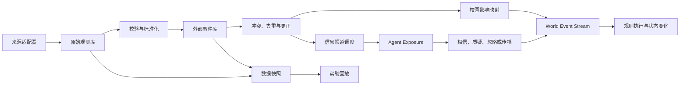

# 外部世界数据接入与因果传播设计

## 1. 文档目的

本文定义真实天气、校园通知、公共新闻、价格、就业、交通、公共卫生等外部数据如何进入校园平行世界。

目标不是“接入更多 API”，而是建立一条可追踪、可回放、可降级的因果链：

```text
外部来源
-> 原始观测
-> 标准化外部事件
-> 校园影响解释
-> 世界状态变化
-> 信息渠道暴露
-> Agent 主观认知
-> 行动与关系变化
-> 可审计的后续结果
```

该系统必须同时支持持续运行的线上世界和可复现的研究实验。

## 2. 当前实现状态

阶段 `3.4.1-3.4.5` 已于 2026-07-30 在现有 FastAPI 和数据库边界内完成：

- `external_sources`、`external_sync_runs` 和不可变
  `external_raw_observations` 保存来源、同步批次、内容哈希、原始 payload、解析版本和
  校验状态。
- 固定 RSS 与 Open-Meteo 天气已迁入独立来源适配器；同步通过独立 API 或外部调度发起，
  world tick 不执行网络请求。
- 版本化事件目录、`external_events` 和 `external_event_links` 处理统一时间/范围语义、
  同源幂等、跨来源印证、冲突、更正、替代和撤回历史。
- `external_data_snapshots`、四种运行模式、确定性回放投放和
  `external_exposures` 已将客观事件与 Agent 主观获知分离。
- `external_event_impacts` 只通过版本化确定性规则映射到阶段 3.2 冲击，再写入
  `world_event_stream`；高影响、低置信、来源冲突或治理未通过的事件不会修改关键状态。
- 来源审核、角色权限、保留期、敏感级别、运行健康、实验版本绑定和快照导出已落库。
  来源失败、过期或整体不可用时暴露 `stale` / `external_data_degraded`，内部世界继续推进。
- 现有 `external_information` 和 `agent_information` 保留为单向兼容投影，前端无需一次性
  切换；它们不再作为客观世界状态的事实来源。

当前仍不需要拆成独立微服务。只有在吞吐量、团队边界、独立扩缩容或多实例 leader
协调成为实际瓶颈后，再将 ingestion worker 从同一代码库拆分部署。

## 3. 设计原则

### 3.1 外部数据不等于世界真相

一条 RSS 新闻首先只是某个来源发布的一条观测。只有通过验证、标准化和影响映射后，它才可能成为世界事件。

```text
来源说了什么 != 客观发生了什么
客观发生了什么 != 每个 Agent 都知道什么
Agent 知道什么 != Agent 相信什么
Agent 相信什么 != Agent 一定据此行动
```

### 3.2 客观影响与信息传播分开

暴雨可以客观降低道路通行能力，即使没有 Agent 看到天气预报。与此同时，不同 Agent 可能通过手机、同学或校园广播，在不同时间得知暴雨信息。

每个外部事件应允许产生两条独立链路：

- **环境影响链**：改变天气、交通、价格、供给、制度或空间状态。
- **认知传播链**：通过媒体、组织和关系网络进入个人认知。

### 3.3 保存来源、时间和不确定性

不得只保存一段摘要。每个事件都要保留来源、原始记录、转换版本、置信度和完整时间语义。

至少区分：

- `occurred_at`：事件实际发生时间。
- `published_at`：来源发布时间。
- `observed_at`：上游数据声称的观测时间。
- `ingested_at`：系统抓取时间。
- `effective_from` / `effective_to`：事件影响世界的时间范围。
- `expires_at`：超过该时间后不再作为新信息传播。

### 3.4 实时运行与实验复现同等重要

线上世界可以消费实时数据；研究运行必须绑定冻结快照或确定性回放流。任何实验结果都应能回答“当时使用了哪一版外部数据和转换规则”。

### 3.5 外部内容默认不可信

外部文本、链接和结构化响应都属于不可信输入。解析失败、提示注入、恶意 HTML、异常大响应、错误单位和伪造时间都必须在接入层处理，不能直接进入 LLM 上下文或世界状态。

## 4. 总体架构



抓取任务不能在 world tick 的关键事务中发起外部网络请求。同步任务先独立完成抓取和提交，runtime 只消费已经写入数据库的标准化事件。

## 5. 核心数据层

### 5.1 来源注册 `external_sources`

保存来源身份和运行策略：

```text
id
name
source_type              rss / weather / api / file / manual
base_url
adapter_key
enabled
trust_prior
allowed_event_types
poll_interval_seconds
timeout_seconds
rate_limit
license_note
config_json
last_success_at
created_at / updated_at
```

密钥只保存环境变量引用，不写入数据库配置或日志。

### 5.2 原始观测 `external_raw_observations`

原始观测是不可变审计记录：

```text
id
source_id
source_record_id
request_fingerprint
content_hash
http_status
content_type
payload
observed_at
ingested_at
parser_version
sync_run_id
validation_status
validation_errors
```

相同 `source_record_id` 或 `content_hash` 的重复结果可以引用已有 payload，但不能静默覆盖历史记录。

### 5.3 标准化事件 `external_events`

建议统一字段：

```text
id
event_type
title
summary
source_id
raw_observation_id
source_record_id
occurred_at
published_at
observed_at
ingested_at
effective_from
effective_to
expires_at
geo_scope
campus_scope
affected_spaces
affected_roles
affected_organizations
affected_economic_sectors
magnitude
direction
unit
severity
novelty
confidence
verification_state
payload
transform_version
correction_of
replaces_event_id
created_at
```

`event_type` 使用版本化事件目录，第一阶段建议支持：

```text
weather.condition_changed
weather.warning_issued
campus.notice_published
campus.facility_closed
transport.service_changed
economy.price_changed
economy.supply_disrupted
labor.opportunity_changed
policy.rule_changed
health.risk_changed
news.public_event_reported
```

新闻报道和它描述的事件不能总被合并。多个报道可指向同一事件，也可以因证据不足仅保持为“被报道事件”。

### 5.4 事件关系 `external_event_links`

用于表达：

- 多来源相互印证。
- 两条记录可能描述同一事件。
- 来源之间存在冲突。
- 新事件修正、替代或撤回旧事件。
- 一条宏观事件由多个子事件组成。

更正不能修改历史并假装旧信息从未存在。系统应发布更正事件，并决定哪些 Agent 能接触到更正。

### 5.5 校园影响 `external_event_impacts`

外部事实不能直接随意改字段。影响映射先产生结构化候选：

```text
id
external_event_id
impact_type
target_type
target_id
state_key
operation
value
unit
starts_at
ends_at
confidence
rule_version
status                    proposed / validated / applied / rejected
world_event_id
reason
```

例如：

| 外部事件 | 客观影响 | 认知传播 |
| --- | --- | --- |
| 暴雨预警 | 户外舒适度下降、路径耗时增加、活动可能取消 | 天气 App、校园广播、同伴提醒 |
| 食材批发价上涨 | 食堂成本先上升，价格是否调整由经营规则决定 | 菜单、校园日报、学生讨论 |
| 招聘机会增加 | 可申请岗位和工资区间变化 | 招聘网站、学院群、朋友转发 |
| 教学楼停电通知 | 空间能力和课程安排变化 | 官方通知、教师、现场观察 |

## 6. 去重、冲突与可信度

去重按三层处理：

1. **来源内去重**：使用上游 ID、URL、发布时间和内容哈希。
2. **跨来源候选聚合**：按实体、地点、时间窗口和语义指纹寻找同一事件。
3. **人工或规则确认**：高影响且冲突的事件进入待确认状态，不自动合并。

可信度建议由可解释因子组成：

```text
confidence =
  source_prior
  * parse_quality
  * freshness_factor
  * corroboration_factor
  * conflict_penalty
```

注意：

- `confidence` 表示系统对事件解释的信心，不表示 Agent 必须相信。
- Agent 的信任还受渠道、关系、既有立场和重复暴露影响。
- LLM 可以协助分类和摘要，但不能仅凭语言流畅度提高事实可信度。
- 高影响事件应要求权威来源、多个独立来源或人工确认。

## 7. 因果应用机制

外部事件进入世界需要经过：

```text
标准化事件
-> 影响规则匹配
-> 候选影响
-> 边界和单位校验
-> 写入 world_event_stream
-> runtime 执行
-> 状态变化与反馈日志
```

影响规则必须是版本化、可测试的确定性规则。LLM 可以提出候选解释，但不能直接执行余额变更、价格修改、空间关闭或政策生效。

每次应用都应记录：

- 使用的外部事件和原始观测。
- 使用的规则版本和参数。
- 变更前后状态。
- 影响开始、结束和撤销条件。
- 未应用或降级的原因。

同一个事件重复消费必须保持幂等。

## 8. Agent 暴露、认知与传播

现有 `agent_information` 可以逐步演化为 `external_exposures`，记录：

```text
event_id
agent_id
channel
sender_agent_id
scheduled_at
delivered_at
noticed_at
credibility_at_delivery
distortion
attention_cost
response                    believed / doubted / ignored / shared
memory_id
```

渠道至少区分：

- 官方通知：覆盖明确、可信度较高，但不保证所有人及时阅读。
- 公共媒体：覆盖较广，受兴趣和推荐机制影响。
- 现场观察：范围小，证据直接。
- 组织网络：学院、社团、班级、工作单位。
- 人际传播：由关系强度、接触机会和传播意愿决定。
- 校园日报：经过编辑筛选的公共叙事，不等同于实时事实源。

传播过程中允许遗漏、摘要、强调和误解，但必须保留传播链。更正消息不会自动删除旧记忆，只会形成新的证据，Agent 是否修正认知由自身机制决定。

## 9. 运行模式

每个世界实例或实验运行必须选择一种模式：

| 模式 | 用途 | 行为 |
| --- | --- | --- |
| `live` | 持续线上世界 | 按真实时间拉取，允许后续更正 |
| `snapshot` | 可复现实验 | 只读取封存快照，不访问网络 |
| `replay` | 历史重演 | 按原始事件时间和可配置倍率投放 |
| `synthetic` | 压力测试与反事实 | 只使用人工生成且明确标记的事件 |

`live` 运行也应周期性封存快照。实验元数据必须记录：

```text
external_mode
snapshot_id
event_catalog_version
transform_version
impact_rule_version
simulation_seed
```

## 10. 同步与调度

不同来源独立设置频率：

| 数据 | 建议频率 | 允许过期时间 |
| --- | --- | --- |
| 时间 | 每 tick 读取系统时钟 | 1 个 tick |
| 恶劣天气预警 | 5-15 分钟 | 30 分钟 |
| 常规天气 | 15-30 分钟 | 2 小时 |
| 校园通知 | 5-15 分钟 | 1 小时 |
| 交通 | 5-15 分钟 | 30 分钟 |
| 价格与就业 | 每日或按来源更新 | 1-7 天 |
| 公共新闻 | 1-3 小时 | 6 小时 |

每轮同步写入 `external_sync_runs`：

```text
source_id
started_at / finished_at
status
request_count
raw_count
new_event_count
duplicate_count
error_count
cursor_before / cursor_after
error_summary
```

需要：

- 超时、指数退避和带抖动的重试。
- 每来源速率限制与调用预算。
- leader lock，防止多个 Render 实例重复执行同一同步任务。
- dead-letter 状态，避免坏记录阻塞整个来源。
- cursor 只在本轮数据成功提交后推进。
- runtime 查询采用索引和批量消费，不在每个 Agent 决策时重复查外部源。

## 11. 快照与回放

`external_data_snapshots` 保存快照元数据，快照条目引用原始观测和标准化事件。封存后不可修改，只能生成新版本。

回放调度使用事件原始时间差：

```text
replay_world_time =
  replay_start_world_time
  + (event_time - snapshot_start_time) / replay_speed
```

同一快照、规则版本和随机种子应产生相同的外部事件投放顺序。外部 API 当时返回的内容不能靠“再次请求”复原。

## 12. API 边界

建议逐步提供：

```text
GET  /api/external/sources
POST /api/external/sources/{id}/sync
GET  /api/external/sync-runs
GET  /api/external/events
GET  /api/external/events/{id}
GET  /api/external/events/{id}/provenance
GET  /api/external/events/{id}/impacts
GET  /api/external/events/{id}/exposures
POST /api/external/snapshots
GET  /api/external/snapshots
POST /api/external/replays
POST /api/external/synthetic-events
```

权限原则：

- 普通观察者可读取经过清洗的事件和公开来源说明。
- 研究者可读取快照版本、转换版本和匿名化传播链。
- Admin 才能同步、修正、封存、回放和注入合成事件。
- 原始 payload、访问凭据和可能包含个人信息的数据需要更严格权限。

现有 `/api/external-information` 可保留为兼容接口，数据逐步改为从新事件层投影，避免前端和已有部署一次性中断。

## 13. 安全、隐私与合规

- 来源 URL 使用 allowlist，防止 SSRF 和任意内网访问。
- 限制响应大小、MIME 类型、重定向次数和连接时间。
- HTML 转纯文本并清除脚本、跟踪参数和不可见指令。
- 外部文本进入 LLM 前使用明确的数据边界，禁止把正文当系统指令执行。
- API Key 通过 secrets 管理，日志中脱敏。
- 记录来源许可、署名、缓存和再分发限制。
- 默认不接入个人位置、私人社交账号和可识别个体的数据。
- 必须接入个人数据时，先完成用途、保留期、删除和访问控制设计。

## 14. 可观测性与降级

关键指标：

```text
source_success_rate
ingestion_lag
event_freshness
duplicate_rate
parse_failure_rate
conflict_rate
correction_rate
impact_application_rate
exposure_delivery_lag
dead_letter_count
```

降级规则：

- 来源失败时继续运行校园世界，不伪造“最新数据”。
- 使用缓存值时明确标记 `stale` 和最后成功时间。
- 数据超过允许过期时间后停止产生新的客观影响。
- 多来源冲突时保留各自说法，高影响事件暂缓应用。
- 某个适配器失败不能阻塞其他适配器和 world tick。
- 外部系统整体不可用时，runtime 进入 `external_data_degraded`，已有世界状态继续按内部规则演化。

## 15. 首批来源优先级

接入顺序应由因果价值决定，而不是由 API 数量决定：

1. **天气与恶劣天气预警**：直接影响空间、路径、活动和身体状态。
2. **校园官方通知与设施状态**：直接影响课程、空间和制度约束。
3. **交通与周边可达性**：影响到达时间、外出和供给。
4. **基础价格、供给和就业数据**：支撑经济规律和机会结构。
5. **公共卫生与政策变化**：适合低频、高影响事件。
6. **公共新闻和社会趋势**：主要进入认知传播，客观影响需谨慎映射。

第一版不建议抓取高噪声社交媒体。它会显著增加身份、隐私、机器人内容、操纵和事实核验成本，却不一定改善经济和环境因果真实性。

## 16. 分阶段迁移

本节是 `ENVIRONMENT_REALISM_ROADMAP.md` 阶段 3.4 的实施子序列。编号与总路线图
保持一致，不建立另一套平行阶段。

### 3.4.1 可审计接入层

- 建立 `external_sources`、`external_raw_observations` 和 `external_sync_runs`。
- 把固定 RSS 和天气抓取迁入适配器。
- 保留现有 API 和表写入，确保前端兼容。

### 3.4.2 事件标准化

- 建立事件目录、`external_events` 和事件关系。
- 完成时间、范围、可信度、去重、冲突和更正语义。
- 现有 `external_information` 改为标准化事件的兼容投影。

### 3.4.3 快照、回放与认知传播

- 增加 `snapshot`、`replay` 和 `synthetic` 模式。
- 将 `agent_information` 迁移或扩展为可追踪暴露记录。
- 支持更正信息沿渠道再次传播。

### 3.4.4 环境及经济因果映射

- 建立 `external_event_impacts` 和版本化影响规则。
- 先接天气、设施、交通，再接价格、供给和就业。
- 将应用结果写入 `world_event_stream`，并纳入状态对账。

### 3.4.5 治理、研究与运行验收

- 来源许可、数据保留、人工审核和角色权限。
- 快照导出、实验元数据、校准指标和反事实比较。
- 验证来源故障、数据过期和外部系统不可用时的降级运行。
- 根据实际吞吐量决定是否拆成独立 ingestion worker 或服务。

## 17. 验收标准

外部数据子系统达到可用状态至少需要：

- 任意世界事件能追溯到来源、原始响应、转换和影响规则。
- 相同数据重复同步不会重复应用世界影响。
- 来源更正不会覆盖历史，且可触发认知修正传播。
- 外部服务断开时 world runtime 仍能推进并暴露降级状态。
- 快照模式在相同种子和版本下保持事件顺序一致。
- Agent 不会因为事件存在于数据库就自动知道它。
- 客观环境变化与 Agent 主观认知可分别查询。
- 高影响事件在证据不足或来源冲突时不会自动修改关键状态。
- 天气、设施或价格事件至少有一个能产生可验证的后续行为差异。
- 日报能引用已发生或被报道的事件，并区分事实、传闻和评论。

## 18. 测试策略

- 适配器契约测试：固定样本验证解析、单位和时间。
- 幂等测试：同一批数据同步两次只产生一次有效影响。
- 去重与冲突测试：同源重发、跨源同事件、互相矛盾的报道。
- 时间测试：迟到事件、未来时间、夏令时、过期和回放倍率。
- 故障测试：超时、429、半批失败、坏 JSON、大响应和数据库重试。
- 安全测试：SSRF、恶意 HTML、提示注入文本和密钥脱敏。
- 因果测试：输入已知事件后检查 world state、日志和 Agent 暴露差异。
- 回归测试：现有 `/api/external-information` 和前端继续可用。

## 19. 与其他文档的关系

- `WORLD_RUNTIME_DESIGN.md` 定义世界时钟、tick、任务调度和事件流。
- `ENVIRONMENT_REALISM_ROADMAP.md` 定义外部开放性在整体真实环境中的阶段和依赖。
- `RESEARCH_DATA_DEVELOPMENT.md` 定义实验元数据、数据导出与可复现要求。
- 本文负责外部来源接入、事件标准化、快照回放、Agent 暴露和因果应用边界。

实现时可以分多个小 PR，但表结构和事件语义必须先统一。最重要的架构决定是：外部 API 只提供观测，世界变化由可追踪的规则执行，Agent 认知则通过有限渠道逐步形成。
